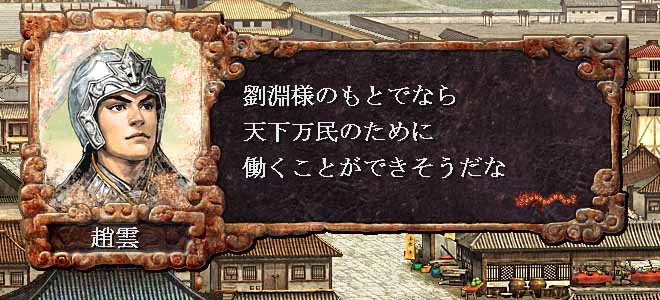

---
title: "三国志８プレイ記３（第六幕）（第６話）"
date: 2013-05-04 13:21:43
category: "ゲーム"
---

※このプレイ記はゲームの進行にあわせて物語を紡いでいます。正史にも演義にもない架空のお話ですからご注意ください。

　

■<strong>劉淵成人し独立す（２１７年）</strong>

　

２１７年　劉淵政策転換

 

趙雲は、そもそも「劉備」こそが天下万民の困窮を救う主だと思い、その配下となったのだ。

しかし近頃の劉備はその青雲の志を捨て、地方の一領主の座に安寧してしまっていた。 劉備はその座を守るために、荊州や蜀の民に兵役を課し国境守備に当たらせるようになっていたため、軍事費は相対的に減った農民に、より重くのしかかっていた。

自らの武は、救世のためにのみ使い、名も実も求めないという考えの趙雲にとって、劉淵が行ってきた涼州の復興行動は、意気を通じるものがあったのかもしれない。

　

【ゲーム的には】

ご想像のとおり、無敵の義兄弟システムを悪用して、寝返り工作を仕掛けています。

４都市合わせて２季で裏切り＆占拠を済ませ、さらに１季を使って部将の配属変えを行い、漢中と長安を腹心で固め、降将等は長安で接待漬けにしている最中です。

文中にもあるとおり、劉淵の魅力が不足しているため、魏以外の部将の登用率が格段に低く、２１５年からの２年間程、深刻な人材不足に悩みました。

そこでチートな作戦を使ってしまいました。

しかしさすがに、梟雄馬超はともかく、あの趙雲キャラを劉備から寝返らせるのは反則だろうと自覚しています。

漢中も長安と武都（下弁）から挟撃すれば奪うことは容易であったのです。

太守の裏切りに釣られて引き抜ける属将も理由にありますが、それだけなら趙雲以外にも選択肢はありました。

それよりも大きかったはただある一点のためでした。そのために寝返り工作をかけてしまいました。

その一点とは、「趙雲を戦場で動かしたい。」という個人的な欲望です。（ああ～もう趙雲また混乱かよ。ヨシヨシ俺が行って沈静してやるから待ってろよ。的な。）

すみません。ゲームなので許して下さい。

　

<a href="https://nyargo1971.github.io/nyargos-blog/sitemap.md">２１６年（その２）←</a> | <a href="https://nyargo1971.github.io/nyargos-blog/sitemap.md">→２１８年</a>

　

<a href="https://nyargo1971.github.io/nyargos-blog/sitemap.md">■黄巾滅ぶも叛乱已まず、群雄連合し賊を討つ（１８７年～１９１年）（シナリオ開始年）</a>

<a href="https://nyargo1971.github.io/nyargos-blog/sitemap.md">■群雄内政に力を注ぎ諸葛亮出廬す（１９２年～１９６年）</a>

<a href="https://nyargo1971.github.io/nyargos-blog/sitemap.md">■少帝崩御し反董卓連合成る（１９７年）</a>

<a href="https://nyargo1971.github.io/nyargos-blog/sitemap.md">■反董卓連合軍の反撃（１９８年～２０２年）</a>

<a href="https://nyargo1971.github.io/nyargos-blog/sitemap.md">■董袁衰微し劉孫繁栄す（２０３年～２０７年）</a>

<a href="https://nyargo1971.github.io/nyargos-blog/sitemap.md">■劉淵成人前夜（２０８年～２１４年）</a>

<a href="https://nyargo1971.github.io/nyargos-blog/sitemap.md">■劉淵立つ（２１５年～）</a>

　

<a href="https://nyargo1971.github.io/nyargos-blog/">ブログトップ</a> | <a href="http://www4.tokai.or.jp/nyargo/html/ano19.html">エクセルで競馬</a> | <a href="http://www4.tokai.or.jp/nyargo/">本家WEBサイト</a>

