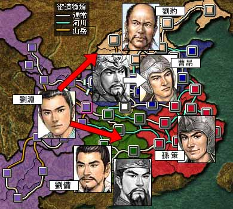

---
title: "三国志８プレイ記３（第七幕）（第２話）"
date: 2013-08-04 17:43:48
category: "ゲーム"
---

※このプレイ記はゲームの進行にあわせて物語を紡いでいます。正史にも演義にもない架空のお話ですからご注意ください。

　

■<strong>劉淵蜀公を賜う（２１９～年）</strong>

　

２２２年（その１）　関羽の死、曹操の死

 

ほぼ史実どおりの順に関羽、曹操が相次いで死去しました。

ゲームに過ぎないのですが、気落ちしてしまいました。

　

今後の劉淵の戦略について、だいぶ悩みましたが、曹操の死を利用しての北伐は、上記のストーリーのとおり取り止めました。

基本的には、今後の劉淵の進路は２通りしかありません。（図の赤い矢印）

すなはち、北を攻めるか南を攻めるか、です。

　

北を攻めた場合、劉備とは現在の前線を国境線とするよう、改めて国交を求め、贈り物を厚くして膠着状態にし、軍の中核を北へと向けることになります。

この場合、北においては戦線がどうしても広がるため、魏や劉豹等の部将の取り込みが課題になります。劉淵軍はまだまだ人材不足なのです。

　

南を攻めた場合、長安の防衛線が崩れない限りは、南征軍に編成してあるほぼ全軍を荊州戦線に向けられます。

ただし、劉備軍、孫策軍はそれぞれ、一種運命共同体のような繋がりを持った軍であるという特徴があり、なかなか味方に引き入れられません。

攻める順を間違えると、あっという間に反撃を食らい、窮地に立つ可能性があります。

特に、現在劉淵がいる永安とこれからの進軍路を想定すれば、史実、演義において、劉備が呉の陸孫に破れたあの関羽の復讐戦を思い出さずにはいられません。

よくよくの計画が必要となります。

　

基本的には、まずは、軍の再配置を行い、占領地の益州の内政に努めつつ、一朝事あれば、即応できる体制を維持する、ということになることでしょう。

　

<a href="https://nyargo1971.github.io/nyargos-blog/sitemap.md">２２１年←</a> | <a href="https://nyargo1971.github.io/nyargos-blog/sitemap.md">→２２２年（その２）</a>

　

<a href="https://nyargo1971.github.io/nyargos-blog/sitemap.md">■黄巾滅ぶも叛乱已まず、群雄連合し賊を討つ（１８７年～１９１年）（シナリオ開始年）</a>

<a href="https://nyargo1971.github.io/nyargos-blog/sitemap.md">■群雄内政に力を注ぎ諸葛亮出廬す（１９２年～１９６年）</a>

<a href="https://nyargo1971.github.io/nyargos-blog/sitemap.md">■少帝崩御し反董卓連合成る（１９７年）</a>

<a href="https://nyargo1971.github.io/nyargos-blog/sitemap.md">■反董卓連合軍の反撃（１９８年～２０２年）</a>

<a href="https://nyargo1971.github.io/nyargos-blog/sitemap.md">■董袁衰微し劉孫繁栄す（２０３年～２０７年）</a>

<a href="https://nyargo1971.github.io/nyargos-blog/sitemap.md">■劉淵成人前夜（２０８年～２１４年）</a>

<a href="https://nyargo1971.github.io/nyargos-blog/sitemap.md">■劉淵立つ（２１５年～）</a>

　

<a href="https://nyargo1971.github.io/nyargos-blog/">ブログトップ</a> | <a href="http://www4.tokai.or.jp/nyargo/html/ano19.html">エクセルで競馬</a> | <a href="http://www4.tokai.or.jp/nyargo/">本家WEBサイト</a>

