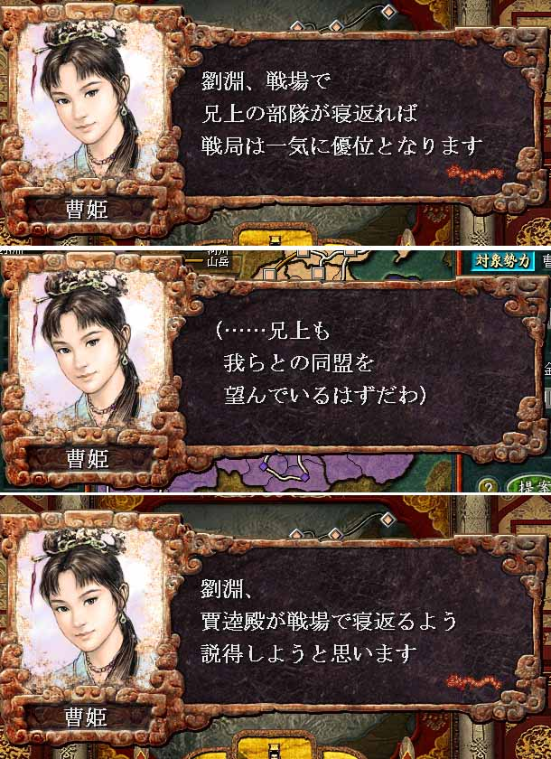

---
title: "三国志８プレイ記３（第八幕）（第１話）"
date: 2013-09-22 20:23:26
category: "ゲーム"
---

■<strong>蜀王劉淵（２２６年）</strong>

　

２２６年（その１）　劉淵、国境を固め内政に腐心す

 

　

劉淵「それよ、それよ。曹姫、武を用いるのはどうしても致し方ないときに限りたいものじゃ。王位に就いたからには、さらにそのことが求められよう。」 「何か良策はあるのか。」

曹姫「殿の名声を使って各地の太守に寝返り工作を仕掛けたいと思います。」

劉淵「うむ、わかった。すすめてくれ。ただし、曹昂殿とはまだ事を構えたくない。」 「…もう一方の勢力に限って工作を進めてくれ。」

曹姫「よろしいのですね。我が策によって、場合によっては南蛮公のお命が縮まる事になるやもしれません。」

劉淵「いつかは戦わねばならぬ定め。早いか遅いかの違いだけじゃ。ならば、なさずして遅れ後悔するようなことになってはいけないと思う。」

曹姫「ご決断なされたのですね。では、もはや何も申しますまい。私は私のすべき事を進めて参ります。」

劉淵「うむ、よろしく頼む。」

　

■ゲーム的には

劉備が降伏しなかったため、彼の家臣団をむざむざ下野させてしまった劉淵でしたが、なんと数ヶ月もしない内に、劉備自身は劉淵の部下の求めに応じて傘下に加わりました。

らしくない、というのが第一観です。

いざとなったら放浪軍を組まれるのも覚悟の上で放逐したのですが、なんとふがいないことでしょう。

興ざめしたのですが、元々は一方の覇者です。長安に招いて百日宴を開き、歓待しました。

しかし、そのらしからぬ劉備の行動も、彼特有の勘だったのでしょうか。天命の尽きたことを肌で感じて弱気になっていたからだったのでしょうか。

２２６年１０月、劉備は没しました。

　

<a href="https://nyargo1971.github.io/nyargos-blog/sitemap.md">２２３年←</a> | <a href="https://nyargo1971.github.io/nyargos-blog/sitemap.md">→２２６年（その２）</a>

　

<a href="https://nyargo1971.github.io/nyargos-blog/sitemap.md">■黄巾滅ぶも叛乱已まず、群雄連合し賊を討つ（１８７年～１９１年）（シナリオ開始年）</a>

<a href="https://nyargo1971.github.io/nyargos-blog/sitemap.md">■群雄内政に力を注ぎ諸葛亮出廬す（１９２年～１９６年）</a>

<a href="https://nyargo1971.github.io/nyargos-blog/sitemap.md">■少帝崩御し反董卓連合成る（１９７年）</a>

<a href="https://nyargo1971.github.io/nyargos-blog/sitemap.md">■反董卓連合軍の反撃（１９８年～２０２年）</a>

<a href="https://nyargo1971.github.io/nyargos-blog/sitemap.md">■董袁衰微し劉孫繁栄す（２０３年～２０７年）</a>

<a href="https://nyargo1971.github.io/nyargos-blog/sitemap.md">■劉淵成人前夜（２０８年～２１４年）</a>

<a href="https://nyargo1971.github.io/nyargos-blog/sitemap.md">■劉淵立つ（２１５年～）</a>

<a href="https://nyargo1971.github.io/nyargos-blog/sitemap.md">■劉淵王即位（２２６年）</a>

　

<a href="https://nyargo1971.github.io/nyargos-blog/">ブログトップ</a> | <a href="http://www4.tokai.or.jp/nyargo/html/ano19.html">エクセルで競馬</a> | <a href="http://www4.tokai.or.jp/nyargo/">本家WEBサイト</a>

