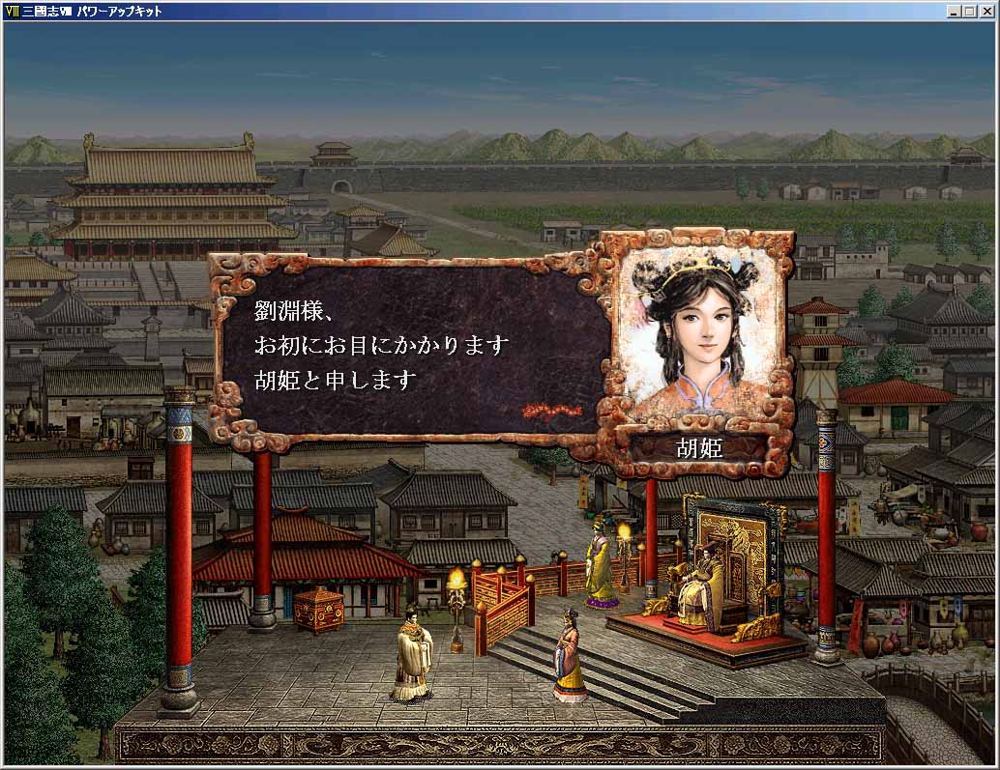

---
title: "三国志８プレイ記３（最終幕）（第１話）"
date: 2013-09-22 23:43:11
category: "ゲーム"
---

■<strong>帝位禅譲そして天下統一（２２７～年）</strong>

　

２２７年（その１）　帝位への階段

 

名を胡姫といい、公主ではないようであるが、献帝の遠縁にあたるとのことであった。

　

■ゲーム的には

王即位となれば相当数の都市を支配下に治めており、もはやNPC相手に滅亡などあり得ません。

後はいかに目的に添って効率よく進めるかと言うことになります。

　

今回は、善政が目的であるため、部将の武功などは二の次にして、なるべく戦を少なく進める形での戦略を考えています。

三国志Ⅲからおなじみの都市間を道が結ぶ形式のマップでは、攻める都市の順序が、時として大きな正否を分けます。

翌年に一度これで失敗を犯すことになります。

劉豹の戦力を甘く見つもり、都市を奪われ、イナゴ戦術にしてやられ、統一を長引かせることになりました。

故意に負けたわけではありません。

しかし、劉豹・キョウ望コンビの強力さを痛感した私は、無理な防戦を諦めました。

ターンの順番が先に劉豹に回ってくることもあり、劉淵陣営は不利です。

このため、次の次を読んで、劉豹の攻め口を限定させるために、脇道の都市には強力な軍団を配置し、イナゴ戦術の進行方向には、無抵抗の開城を認め、都市の疲弊を極力無くし、かつ、劉豹を逃げ場の選択肢が少ない北方へ追いやりました。

そして、翌２２８年には最後の戦いを迎えます。

　

<a href="https://nyargo1971.github.io/nyargos-blog/sitemap.md">２２６年（その３）←</a> | <a href="https://nyargo1971.github.io/nyargos-blog/sitemap.md">→２２７年（その２）</a>

　

<a href="https://nyargo1971.github.io/nyargos-blog/sitemap.md">■黄巾滅ぶも叛乱已まず、群雄連合し賊を討つ（１８７年～１９１年）（シナリオ開始年）</a>

<a href="https://nyargo1971.github.io/nyargos-blog/sitemap.md">■群雄内政に力を注ぎ諸葛亮出廬す（１９２年～１９６年）</a>

<a href="https://nyargo1971.github.io/nyargos-blog/sitemap.md">■少帝崩御し反董卓連合成る（１９７年）</a>

<a href="https://nyargo1971.github.io/nyargos-blog/sitemap.md">■反董卓連合軍の反撃（１９８年～２０２年）</a>

<a href="https://nyargo1971.github.io/nyargos-blog/sitemap.md">■董袁衰微し劉孫繁栄す（２０３年～２０７年）</a>

<a href="https://nyargo1971.github.io/nyargos-blog/sitemap.md">■劉淵成人前夜（２０８年～２１４年）</a>

<a href="https://nyargo1971.github.io/nyargos-blog/sitemap.md">■劉淵立つ（２１５年～）</a>

<a href="https://nyargo1971.github.io/nyargos-blog/sitemap.md">■劉淵王即位（２２６年）</a>

<a href="https://nyargo1971.github.io/nyargos-blog/sitemap.md">■帝位禅譲そして天下統一（２２７～年）</a>

<a href="https://nyargo1971.github.io/nyargos-blog/">ブログトップ</a> | <a href="http://www4.tokai.or.jp/nyargo/html/ano19.html">エクセルで競馬</a> | <a href="http://www4.tokai.or.jp/nyargo/">本家WEBサイト</a>

