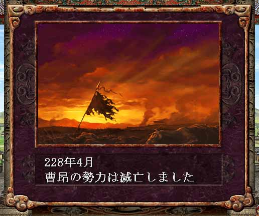

---
title: "三国志８プレイ記３（最終幕）（第４話）"
date: 2013-09-23 16:55:07
category: "ゲーム"
---

■<strong>帝位禅譲そして天下統一（２２７～年）</strong>

　

２２８年（その２）　曹昂の滅亡

 

　

しかし、曹姫のとりなしによって曹昂以下全部将は助命されたばかりでなく、洛陽で大いに歓迎されると、各将は劉淵の政への協力を約束した。

劉淵も、彼等を中原諸地域の復興作業に従事させるべく、再配置を行った。

　

■ゲーム的には

籠城する部将数が少なく、混乱が回復されない見込みがあるならば、挑発によって敵部将を外に釣り出す戦術が有効です。

城壁の修復にはかなりの歳月を擁するため、内政を重視するなら、城門攻撃以外の作戦もとってみるべきです。

また、全員釣り出せなくても、討って出た将を順次包囲殲滅すれば、城兵の士気は下がり逃亡兵が増加するので、一石二鳥となります。

　

<a href="https://nyargo1971.github.io/nyargos-blog/sitemap.md">２２８年（その１）←</a> | <a href="https://nyargo1971.github.io/nyargos-blog/sitemap.md">→２２８年（その３）</a>

　

<a href="https://nyargo1971.github.io/nyargos-blog/sitemap.md">■黄巾滅ぶも叛乱已まず、群雄連合し賊を討つ（１８７年～１９１年）（シナリオ開始年）</a>

<a href="https://nyargo1971.github.io/nyargos-blog/sitemap.md">■群雄内政に力を注ぎ諸葛亮出廬す（１９２年～１９６年）</a>

<a href="https://nyargo1971.github.io/nyargos-blog/sitemap.md">■少帝崩御し反董卓連合成る（１９７年）</a>

<a href="https://nyargo1971.github.io/nyargos-blog/sitemap.md">■反董卓連合軍の反撃（１９８年～２０２年）</a>

<a href="https://nyargo1971.github.io/nyargos-blog/sitemap.md">■董袁衰微し劉孫繁栄す（２０３年～２０７年）</a>

<a href="https://nyargo1971.github.io/nyargos-blog/sitemap.md">■劉淵成人前夜（２０８年～２１４年）</a>

<a href="https://nyargo1971.github.io/nyargos-blog/sitemap.md">■劉淵立つ（２１５年～）</a>

<a href="https://nyargo1971.github.io/nyargos-blog/sitemap.md">■劉淵王即位（２２６年）</a>

<a href="https://nyargo1971.github.io/nyargos-blog/sitemap.md">■帝位禅譲そして天下統一（２２７～年）</a>

<a href="https://nyargo1971.github.io/nyargos-blog/">ブログトップ</a> | <a href="http://www4.tokai.or.jp/nyargo/html/ano19.html">エクセルで競馬</a> | <a href="http://www4.tokai.or.jp/nyargo/">本家WEBサイト</a>

