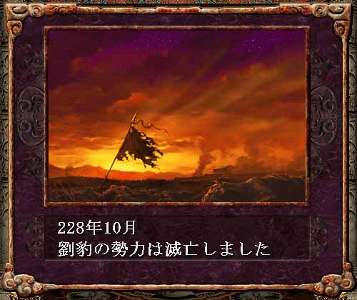

---
title: "三国志８プレイ記３（最終幕）（第５話）"
date: 2013-09-23 17:53:20
category: "ゲーム"
---

■<strong>帝位禅譲そして天下統一（２２７～年）</strong>

　

２２８年（その３）　THE LAST WAR

 

　

■ゲーム的には

自分で育てた部将は強力ですが、それでもNPCとなっていれば、その強さに限界があります。

今回は、劉豹を育ていわゆるパーフェクト部将近くまで成長させたあと、息子劉淵を下野独立させ、親子相打つ設定になりましたが、それ以外でも、強力な曹操に立ち向かう劉備などといった状況を作り出す場合でも、一時的に敵武将を操作し、強力な敵国を育て上げる、といった事は行います。

しかし、結局NPCに委任した時点で、せっかく苦心した防衛拠点の部将編成なども、１年と絶たぬ内にシャッフルされたり、余計な突出により後方に隙が生じたりして、往々にして思い通りの強力な敵勢として居続けてはくれません。

NPCはたいがい後方都市を軽視し前線の厚みを過剰にします。

そうすると、国境のどこか一箇所を破られると、途端に隙が生じてしまいます。

援軍の重要性からも、三国志８では、最前線以外の都市の軍編成の方が実は重要です。

主戦場の部隊は、委任出撃でなければ、君主や軍団長が操作可能です。特に防衛の時には操作が可能です。（例外は、都市方針が委任の時の太守の判断による出撃。操作できません。）

極端なことを言えば、援軍都市をプレイヤーが握り、最前線はNPCに内政重視をさせ、勝手に攻めないようにさせていれば良いわけです。

　

<a href="https://nyargo1971.github.io/nyargos-blog/sitemap.md">２２８年（その２）←</a> | <a href="https://nyargo1971.github.io/nyargos-blog/sitemap.md">→２２８年（その４）</a>

　

<a href="https://nyargo1971.github.io/nyargos-blog/sitemap.md">■黄巾滅ぶも叛乱已まず、群雄連合し賊を討つ（１８７年～１９１年）（シナリオ開始年）</a>

<a href="https://nyargo1971.github.io/nyargos-blog/sitemap.md">■群雄内政に力を注ぎ諸葛亮出廬す（１９２年～１９６年）</a>

<a href="https://nyargo1971.github.io/nyargos-blog/sitemap.md">■少帝崩御し反董卓連合成る（１９７年）</a>

<a href="https://nyargo1971.github.io/nyargos-blog/sitemap.md">■反董卓連合軍の反撃（１９８年～２０２年）</a>

<a href="https://nyargo1971.github.io/nyargos-blog/sitemap.md">■董袁衰微し劉孫繁栄す（２０３年～２０７年）</a>

<a href="https://nyargo1971.github.io/nyargos-blog/sitemap.md">■劉淵成人前夜（２０８年～２１４年）</a>

<a href="https://nyargo1971.github.io/nyargos-blog/sitemap.md">■劉淵立つ（２１５年～）</a>

<a href="https://nyargo1971.github.io/nyargos-blog/sitemap.md">■劉淵王即位（２２６年）</a>

<a href="https://nyargo1971.github.io/nyargos-blog/sitemap.md">■帝位禅譲そして天下統一（２２７～年）</a>

<a href="https://nyargo1971.github.io/nyargos-blog/">ブログトップ</a> | <a href="http://www4.tokai.or.jp/nyargo/html/ano19.html">エクセルで競馬</a> | <a href="http://www4.tokai.or.jp/nyargo/">本家WEBサイト</a>

