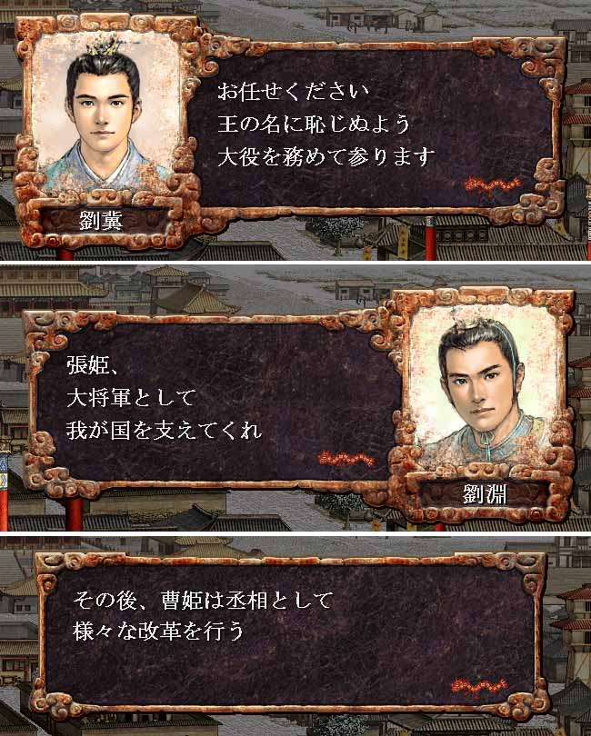

---
title: "三国志８プレイ記３（最終幕）（第６話）"
date: 2013-09-23 19:26:48
category: "ゲーム"
---

■<strong>帝位禅譲そして天下統一（２２７～年）</strong>

&nbsp;

２２８年（その４）　天下統一

 

&nbsp;

こうして、劉淵の治世に於いて、漢は最大の領土に広がることになる。

それは、決して武威によるのではなく、良政の結果、いわば徳の力によって、なされたのである。

&nbsp;

&nbsp;

【<strong>完</strong>】

&nbsp;

■ゲーム的には

エンディングの種類について

詳細は攻略本や解説WEBサイトがあるので省略しますが、not君主プレイの場合、最高の勲功は「王即位」エンディングでしょう。

名声や軍功など各種条件がありますが、中でも最も難しいのが、所属勢力の三分の一以上の部将との親密が好意以上であること、という条件でしょう。

通常はとにかく時間をかけて会話を繰り返すしかありません。

仲良くなった部将を軍団内の他都市に送り出すと、NPC君主がプレイヤー都市の人数不足を心配して、勝手に自都市に補充の部将を送り込んでくれることもあります。自都市の部将は接待漬けがベスト。

一番問題なのは、最後の敵を倒したときに、多くの親密ではない将等が降伏して、自勢力に組み込まれる場合です。

敵とも仲良く必要があります。

&nbsp;

<a href="https://nyargo1971.github.io/nyargos-blog/sitemap.md">２２８年（その３）←</a> | <a href="https://nyargo1971.github.io/nyargos-blog/sitemap.md"><strong>→？年</strong></a>

&nbsp;

<a href="https://nyargo1971.github.io/nyargos-blog/sitemap.md">■黄巾滅ぶも叛乱已まず、群雄連合し賊を討つ（１８７年～１９１年）（シナリオ開始年）</a>

<a href="https://nyargo1971.github.io/nyargos-blog/sitemap.md">■群雄内政に力を注ぎ諸葛亮出廬す（１９２年～１９６年）</a>

<a href="https://nyargo1971.github.io/nyargos-blog/sitemap.md">■少帝崩御し反董卓連合成る（１９７年）</a>

<a href="https://nyargo1971.github.io/nyargos-blog/sitemap.md">■反董卓連合軍の反撃（１９８年～２０２年）</a>

<a href="https://nyargo1971.github.io/nyargos-blog/sitemap.md">■董袁衰微し劉孫繁栄す（２０３年～２０７年）</a>

<a href="https://nyargo1971.github.io/nyargos-blog/sitemap.md">■劉淵成人前夜（２０８年～２１４年）</a>

<a href="https://nyargo1971.github.io/nyargos-blog/sitemap.md">■劉淵立つ（２１５年～）</a>

<a href="https://nyargo1971.github.io/nyargos-blog/sitemap.md">■劉淵王即位（２２６年）</a>

<a href="https://nyargo1971.github.io/nyargos-blog/sitemap.md">■帝位禅譲そして天下統一（２２７～年）</a>

<a href="https://nyargo1971.github.io/nyargos-blog/">ブログトップ</a> | <a href="http://www4.tokai.or.jp/nyargo/html/ano19.html">エクセルで競馬</a> | <a href="http://www4.tokai.or.jp/nyargo/">本家WEBサイト</a>

