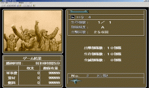

---
title: "リアルタイム大戦略４ＩＶコンプリートボックス（アメリカ無双編）"
date: 2023-12-23 23:26:59
category: "ゲーム"
---

※リアルタイム大戦略４は、初期配置最大４０ユニットで、最大4国でプレイ。敵の司令部を全部破壊することが勝利条件のウォー・シミュレーション・ゲームです。

　

生産国は、いくつかあるのですが、全ての兵種の生産（開発）が可能なのは、アメリカだけです。

余りに条件が良すぎて、攻略が簡単になってくると、あまり使わなくなる生産国です。※後述

今回、何年かぶりにプレイしてみました。

　

選択マップは、比較的攻略が容易な「テンカトウイツ　ニ　ムケテ」で赤国（織田信長）をチョイス。

配置ユニットは１０。

構成は、司令部、ホーネット攻撃機、ＵＨ１ヘリ、パトリオット対空ミサイル、M1戦車、ブラットレー兵員輸送車、ブラットレー偵察車、Ｍ１１０長距離砲装甲車両、ＭＬＲＳロケット砲車両、そしてATACMS超長距離ロケット。

一般的な攻略に必要な兵種は一揃えして、ギリ１０ユニット。

　

【第1日目】

大戦略4では司令部周囲の守りを固めて、想定進路どおりに敵をやって来させて迎撃、敵ユニットの数を漸減させていくのが、楽な勝ち方。

司令部近くの空白都市を索敵のために占領していきます。

　

<strong>※アメリカ無双について</strong>

空母と大型輸送機があって、海を渡った先の港湾都市とか、遠隔地の空港のある都市等に、それなりの量の車両を送って守り負けしない拠点を作る、というようなことができる（アメリカとソビエトだけ）

ステルス機があって、実は山道止めの裏技に使える。これは攻撃×設定にした強いユニットに向けてはわざわざ攻めてこないという裏ルーティンが大戦略４にはあるため、抜け道の無い山道にステルス機を置いて空中給油機で1回給油をかけると、それだけでほぼ封鎖が可能。（アメリカだけ。）

その他、全般的に、射程が最大値。

ＡＴＡＣＭＳの射程が３０。大戦略４コンプリートボックスでプレイできるＭＡＰでは、ランス（２５）やスカッド（２０）では、微妙に届かないけど、ＡＴＡＣＭＳ（３０）ならギリギリ敵重要拠点に届く、という配置が散見されます。

ズルい。

戦艦がある。アイオワの射程４の主砲は、唯一無二で、地上ユニット破壊にも抜群の効力を発揮する唯一といっていい艦船。他の艦船の主砲の射程が最大3。

対艦ミサイルトマホークと併せて、結構な無双っぷり。天敵の潜水艦以外で対抗できるのはランクＡまでレベルの上がったキーロフ級くらい。

MLRSの射程は５（ソビエトの同種は４）

 

アメリカ以外の各生産国には、それぞれ弱点があります。

・ソビエト（懐かしいな、この呼び名）

　対空ミサイルの射程が西側より1少ない

　長距離ロケット砲車両の射程が、西側より１少ない

　ステルス航空機がない

　ただし、アメリカ以外では唯一となる大型車両を空輸できる輸送機あり。実は、これのメリットははなはだ大きい。

　また、空母もあるので、戦略上は困るマップが無い。

・ヨーロッパ

　大型車両を空輸できる輸送機が無い

　空母に搭載できる（当時の）最新鋭機が無い（ファントムが上限）

　流石陸軍重視の国是。海を隔てた敵地に港が無いマップ（ＳＷＡＰ　ＬＡＮＤなど）では、ひと工夫が必要になる。

・日本

　大型輸送機も無く、空母もない。

　橋などで陸地が繋がっているマップでは困らないが、空母が無い分ヨーロッパよりも一苦労あり。

・イスラエル

　一時期テストも兼ねて使ってみたけど、利点無し。

　エリア８８ファンで、クフィルに思い入れがあれば。という程度。

　

