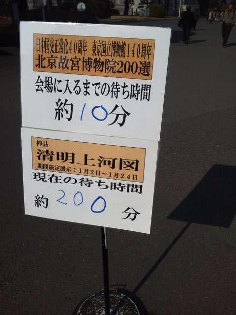

---
title: "北京故宮博物院２００選を見学してきました"
date: 2012-01-11 21:50:44
category: "旅行・地域"
---

東京国立博物館で開催されている北京故宮展を家族揃って見に行ってきました。

いやぁ、本当にすごかったです。中国もよくこんなすごい文物を国外に出しましたね。経済発展がもたらした大人の自信というものを感じます。それともアメリカがF35の提供を決定したのでその対策としてかもしれない…、というのは勘ぐり過ぎですね。

 

神品だけは、特別にそれ専門の列に並ばなくてはいけなかったのですが、それが。

に、２００分…。３時間以上です。

左奥にある平成館の入り口で、入場制限待ちで並んだのですが、その間に家族で打ち合わせをしました。最初は並ぶかという話にまとまりそうだったのですが、入り口での待ち時間は、看板に１０分と書かれているのに結局１５分程度待ちました。ということは、神品を見るには単純計算で１．５倍、３００分（５時間）待ちの計算です。

国立博物館に着いたのが午後１時前でしたので、下手をすると並んでいる内に閉館しそうです。トホホ。結局今日のところは並ばない、という結論になりました。そのかわり他のものを全部見ようと。

★その後、常連（？）の方の話によると、朝イチ開館前に並んで見学するのが、結果的には一番待ち時間が短くなるそうです。いったん列が出来ると、待ち時間はなかなか解消されないとのことでした。

★なお、別の列とは言っても、展示室が独立しているわけではなくロープで仕切られているだけです。このため人垣の間から、ちらっと見ることだけは出来ます。（どの程度見えるかというのは、上野のパンダブームのときと一緒ですので、期待はしないでください。）

　

■<strong>おみやげ</strong>

最後におみやげの話をちょこっと。

あれ？静岡県立美術館でも見たストラップが並んでる。胴元が一緒か？

乾隆帝の絵はがきを買いました。

乾隆帝は皇帝としての使命のために、融和策として中原の服である漢服を着ました。（もともと清という国家は、本来かなり融和政策的な統治をしたのですが、服と髪だけは清のものにするよう定めていました。）

私も去年転勤で職務内容ががらっと変わり、なかなか難しいと感じていましたが、乾隆帝の爪の垢を煎じて飲ませてもらう気持ちで、見習ってがんばろうと思いました。

一つは早速、本館にあるテーブルにて、昨年までお世話になった方に向けて書きまして、上野駅前のポストに投函しました。

　

<a href="https://nyargo1971.github.io/nyargos-blog/">ブログトップ</a> | <a href="http://www4.tokai.or.jp/nyargo/html/ano19.html">エクセルで競馬</a> | <a href="http://www4.tokai.or.jp/nyargo/">本家WEBサイト</a>

