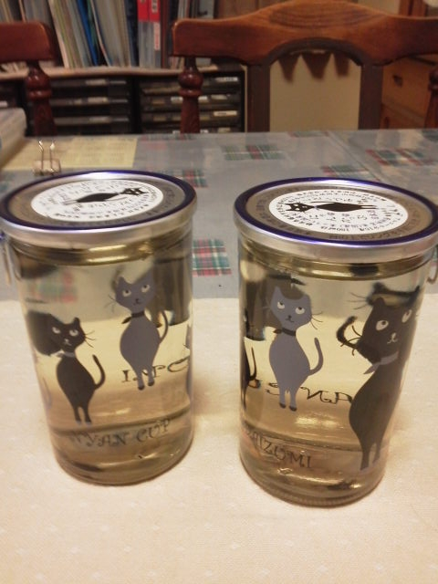
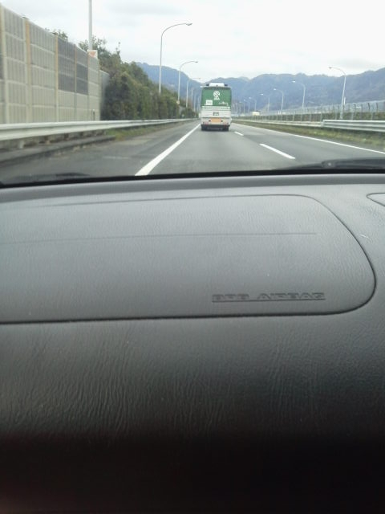

---
title: "島田・牧之原の富士山静岡空港見物に行ってきました"
date: 2012-03-03 12:43:47
category: "旅行・地域"
---

先日、同僚から「静岡空港は行きやすいよ」と聞いたので、見に行ってみる事にしました。

　

■道中は

以前から、駐車場が無料なので車も停めやすい、などは知っていました。

しかし、道が不案内だったので躊躇していたのですが、「看板（道路標識）がそこかしこにあってわかりやすい」と教えてもらい、背中を押されたので行ってみる事に。

確かに分かりやすかったです。

 

志太泉という会社の瓶入りカップ酒です。なお、静岡と猫は特に関連はないので、完全にダジャレ商品です。

でも、かわいかったので２つも買ってきてしまいました。

この手のカップ酒の瓶は、燗酒に対応するため厚口の物が多く頑丈で長持ちするため、何にでも使えて意外と重宝します。私は片方を自分用にもらってペン立てにしようかと思っています。

猫好きには、グッと来るアイテムでは？

<a href="http://shidaizumi.com/sake/nyancup/nyancup2010.html">志太泉酒造（ニャンカップのメーカー）</a>

<a href="http://www.k2.dion.ne.jp/~chisa/">CHISAさん（ニャンカップのイラスト作者）</a>

　

■おまけ

東名の下り線でＪＲＡの馬運トラックを見ました。

今週の競馬は当たるかも！？

 

　

　

<a href="https://nyargo1971.github.io/nyargos-blog/">ブログトップ</a> | <a href="http://www4.tokai.or.jp/nyargo/html/ano19.html">エクセルで競馬</a> | <a href="http://www4.tokai.or.jp/nyargo/">本家WEBサイト</a>

