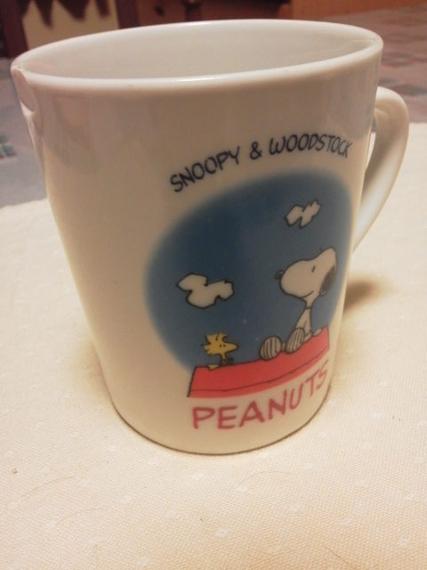

---
title: "さらばスヌーピーマグ"
date: 2012-03-03 13:04:40
category: "旅行・地域"
---

１０年ほど使っていたマグカップが破損しましたので、お別れする事に。

 

ピーナッツのスヌーピー柄で、結構な大きさがあって、気に入っていたのですがとうとう寿命が来たようです。もともと、職場のバザーがあったときに、閉店間際の叩き売りで５０円で手に入れた物でしたので、考えようによっては１年５円換算。よくもってくれました。

さすがスヌーピー柄だけに、長く愛される素質は秘めていたのでしょう。

　

スヌーピーの先代は、大学時代に学園祭で手に入れた、美術科の先輩手焼きの「でかすぎる蕎麦猪口」でした。（こちらは５００円でしたがこれも１０年近くもったと思います。）

　

次のコップ探しはしていますが、こういった物はご縁がないとなかなか…。

　

<a href="https://nyargo1971.github.io/nyargos-blog/">ブログトップ</a> | <a href="http://www4.tokai.or.jp/nyargo/html/ano19.html">エクセルで競馬</a> | <a href="http://www4.tokai.or.jp/nyargo/">本家WEBサイト</a>

