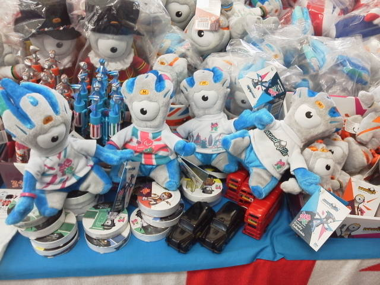

---
title: "清水でロンドン・オリンピック・グッズ"
date: 2012-07-07 15:59:36
category: "旅行・地域"
---

先日ニュースでロンドンオリンピック特集をやっていて、何の気無しに見ていたら、オリンピックグッズについて取り上げた話題でした。 なんでも、公式キャラクターが気持ち悪くて観光客に不評だとか。 でも地元の妖怪がモチーフらしく、近所の子供には結構好評だとも。

どんなものかと気になりニュースの続きを見ていたら、要は「一つ目小僧」でした。

これなら、日本の昔話にも登場するし、どちらかというと狢や狐が一つ目小僧に化けて村人や小僧さんに悪戯するなどといった話に出てくるので、日本では、どちらかといえば愛らしいキャラ系に入ってくるのではないでしょうか。

　

そんな公式キャラ、テレビではちらっと見たけど、実物がまさか地元にあるもんだとは、全く思ってませんでした。

　

◆<a href="http://www.shoji.ne.jp/">（株）ショージ</a>

静岡市清水区の南幹線沿いにありました、売ってるところが。 しかも正規輸入代理店みたいに扱えるのは、この商社とオリンピック委員会だけとかニュースで言っていましたが、本当ですか～？？？ マジ？ってくらいこぢんまりした店舗ですが・・・

 

なんとなくこの青い方のパラリンピック公式キャラが、週刊少年ジャンプの「ジョジョの奇妙な冒険」に登場したキャラ「ゴールド・エクスペリエンス・レクイエム」に見えてきたため、これに決定。

写真後ろの方に写っているバッキンガム宮殿の衛兵キャラも捨てがたいのですが、ＪｏＪｏには勝てませんでした。

　

しかしこのお店、本当に小さい。本当に正規輸入代理店て、ここだけ？日本中で？本当～？

気になる方は、お店でなんか買ったあと、店員さんに聞いてみてください。

　

<a href="https://nyargo1971.github.io/nyargos-blog/">ブログトップ</a> | <a href="http://www4.tokai.or.jp/nyargo/html/ano19.html">エクセルで競馬</a> | <a href="http://www4.tokai.or.jp/nyargo/">本家WEBサイト</a>

