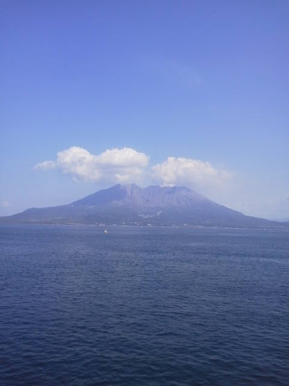
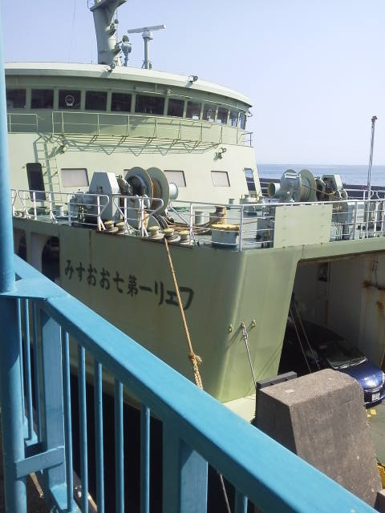
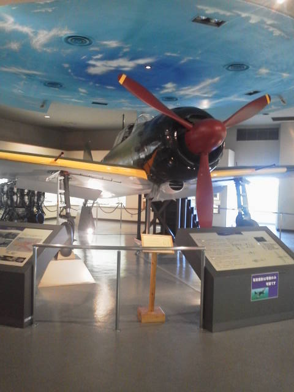
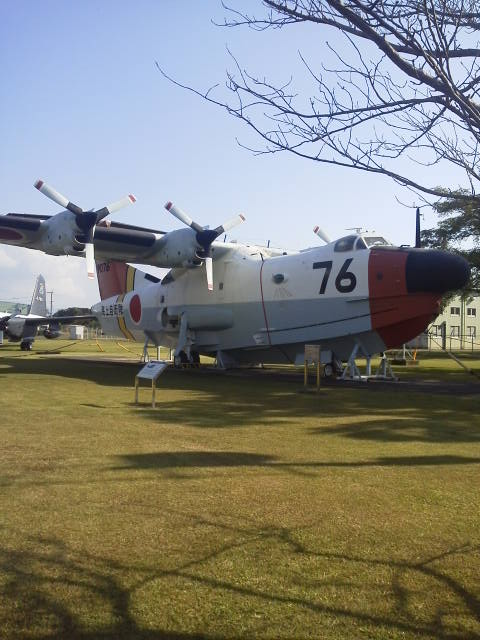
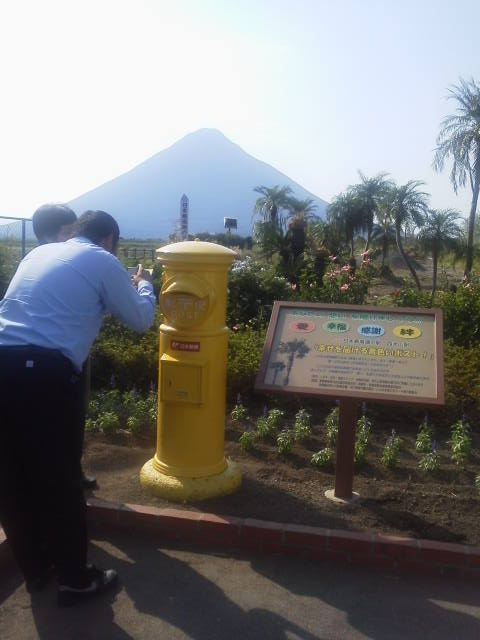
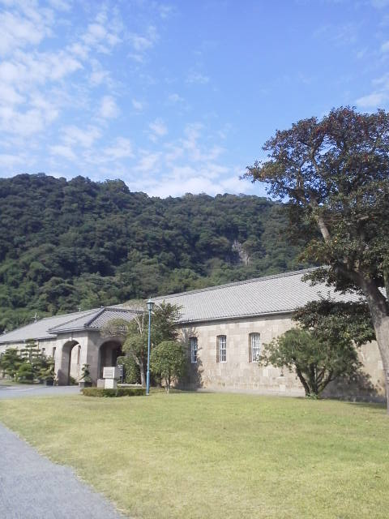
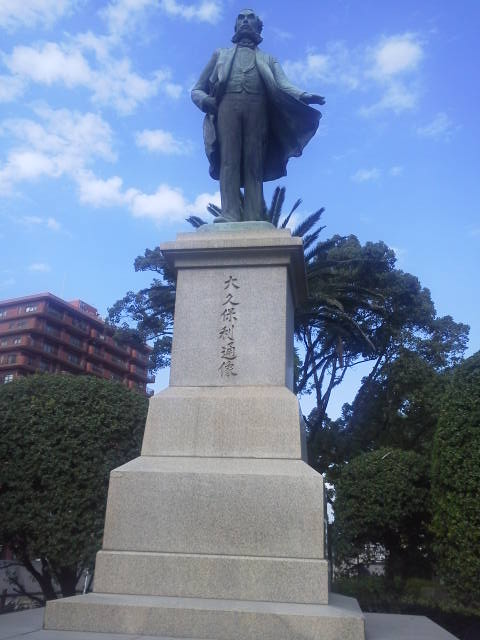

---
title: "鹿児島県へ行ってきました"
date: 2012-10-28 21:46:17
category: "旅行・地域"
---

鹿児島県を家族で旅行してきました。

 

■旅行計画

いやぁ、静岡県も大きいですが鹿児島県も大県です。静岡からはるばる行くまでに時間がかかる上に、訪問先の間の移動距離がまたかなりのもの。 そこで、家族で行きたいところを一つずつあげていき、時間の許す限り上位から回っていく、というチョイスをしました。 私の一番の目的は<a href="http://www.mod.go.jp/msdf/kanoya/sryou/msdf-ks/index.html">「鹿屋」の自衛隊史料館</a>と<a href="http://www.chiran-tokkou.jp/">知覧特効平和会館</a>を見学すること、母がＪＲ西大山駅の黄色いポスト、父は黒豚しゃぶしゃぶ（地名じゃないし）。 地図帳と時刻表、それに静岡空港ダイヤ表とを突き合わせて、２泊３日の旅行を計画しました。

当初、静岡空港を利用することを前提としていましたが、静岡空港－鹿児島便の時刻だと、訪れたいいずれの場所にも閉門時刻過ぎになってしまう、という悲しい結果がわかり断念。 全線開通した九州新幹線を利用することになりました。

■スケジュール

スケジュールは以下のとおり。なお、かなりタクシーを活用して時間短縮を図っています。 静岡－（新幹線）－ＪＲ鹿児島中央駅－鴨池港－（フェリー）－垂水港－鹿屋－<strong>鹿屋史料館</strong>－※１泊－垂水港－鴨池港－ＪＲ鹿児島中央駅－喜入－<strong>知覧</strong>－<strong>ＪＲ西大山駅</strong>－ＪＲ指宿駅－ＪＲ鹿児島中央駅－※１泊－<strong>鹿児島市内観光</strong>－ＪＲ鹿児島中央駅－（新幹線）－静岡

鹿屋の<a href="http://www.satuki.co.jp/index.html">「さつき苑」</a>というホテルで１泊したのですが、地元ではブライダル場も兼ねているところらしく、れいめい庵という和食レストランでいただいたお料理がとても美味しかったです（特にさつま揚げ）。 目的地の鹿屋航空基地史料館へも徒歩で行ける場所にあり、下の幹線道まで降りるとすぐコンビニもあって便利なホテルでした。

　

<a href="https://nyargo1971.github.io/nyargos-blog/sitemap.md">・鹿屋史料館１（屋内）</a>

（ポイント）特攻に関する資料展示のほか、海上自衛隊の資料館であるため、日露戦争の資料等も展示されています。（ＮＨＫドラマ「坂の上の雲」に出てきた日本海海戦の「天気晴朗ナレド波高シ」などの電信原稿（写し）など）。 なお、鹿屋の資料館は、原則屋内の撮影は禁止されていますが、なんとゼロ戦は撮影可。資料写真を撮影してきました。

 

　　

<a href="https://nyargo1971.github.io/nyargos-blog/sitemap.md">・鹿屋史料館２（屋外）</a>

（ポイント）屋外にある飛行機は撮影自由なので、二式飛行艇（二式大艇）を中心に撮影しました。

 

　

２日目は薩摩半島に戻り、知覧などを見学しました。

　

<a href="https://nyargo1971.github.io/nyargos-blog/sitemap.md">・知覧</a>

（ポイント）鹿屋と同じく特攻に関する資料が展示されています。屋内全面撮影禁止。三式戦と四式戦を見学できます。 隣接する野球場のそばに一式戦（隼）が展示されていたため、資料撮影してきました。

 

　

<a href="https://nyargo1971.github.io/nyargos-blog/sitemap.md">・尚古集成館と仙巌園（鹿児島市内）</a>

（ポイント）尚古集成館は薩摩藩（島津家）の歴史についてまとめられています。ただし本来の集成館にあったものは英国軍艦隊の艦砲射撃で吹き飛んでしまってありません。 仙巌園は見事です。中央に松の大木があるのですが、これが見事。 薩摩切子の販売店がありました。とてもきれいなお猪口があったので、清水の舞台から飛び降りるつもりで購入（約３万円）、しばらく水しか飲めません。 高いものでは１００万円台の品も販売していました。ヒエ～。

 

　

<a href="https://nyargo1971.github.io/nyargos-blog/sitemap.md">・偉人像（鹿児島市内）</a>

（ポイント）鹿児島県は偉人の宝庫、このため、銅像もたくさんあります。 町中に点在しているためタクシーで回りましたが、思うように路駐できない場所にもありました。西郷隆盛、大久保利通、東郷平八郎の銅像の下で撮影しました。

 

　

■おまけ

鹿児島県には美人が多かったです。

　

<a href="https://nyargo1971.github.io/nyargos-blog/">ブログトップ</a> | <a href="http://www4.tokai.or.jp/nyargo/html/ano19.html">エクセルで競馬</a> | <a href="http://www4.tokai.or.jp/nyargo/">本家WEBサイト</a>

