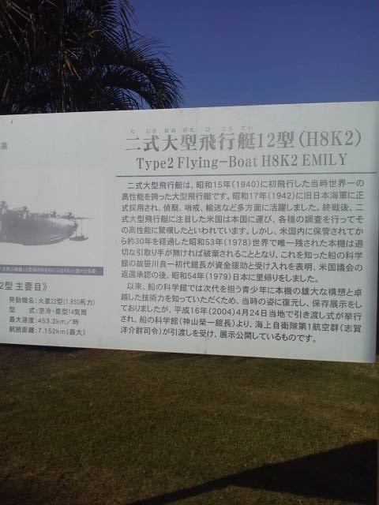

---
title: "鹿児島県へ行ってきました（鹿屋航空基地史料館２）"
date: 2012-11-20 22:58:16
category: "旅行・地域"
---

二式大艇といえば、新谷かおるの戦場ロマンシリーズの疫病船と松本零士のザコクピットの大艇再び還らずを思い出します。

とにかく大きいです。

当時の日本の技術水準も高さを感じ取れます。（四発の発動機の連動、操舵系。単にでかい飛行機を作ってエンジンをたくさん付ければ、飛行できるというものではありません。曲がりませんから。）

二式大艇（模型用資料写真を兼ねているので意味不明なアップ、連取りが多くて済みません。）

正面から１

 

　

<a href="https://nyargo1971.github.io/nyargos-blog/">ブログトップ</a> | <a href="http://www4.tokai.or.jp/nyargo/html/ano19.html">エクセルで競馬</a> | <a href="http://www4.tokai.or.jp/nyargo/">本家WEBサイト</a>

