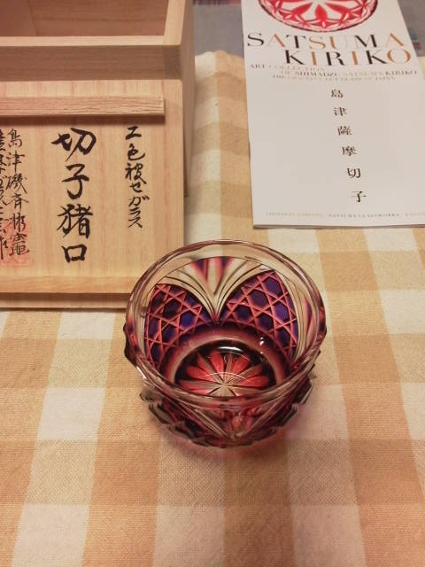

---
title: "薩摩切子到着！"
date: 2013-02-26 06:15:11
category: "旅行・地域"
---

４ヶ月待った薩摩切子がついに我が家に到着しました。

 

名付けて「キュベレイ」です。

　

以前、<a href="https://nyargo1971.github.io/nyargos-blog/sitemap.md">鹿児島旅行についての記事</a>にも書きましたが、この２色のグラデーションは２層の色ガラス（地の透明を含めると３層）を削ることで表現されています。

　

お正月のお屠蘇クラスの大事なイベント用に大切にしまっておきます。（お正月ではずいぶんと遠いですから、年度末のお疲れ様会などで使うことになると思います。）

　

<a href="https://nyargo1971.github.io/nyargos-blog/">ブログトップ</a> | <a href="http://www4.tokai.or.jp/nyargo/html/ano19.html">エクセルで競馬</a> | <a href="http://www4.tokai.or.jp/nyargo/">本家WEBサイト</a>

