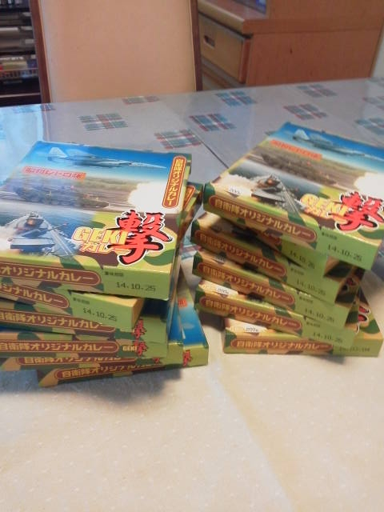

---
title: "航空自衛隊浜松基地広報館へ行ってきました２"
date: 2013-04-28 11:52:12
category: "旅行・地域"
---

昨日書いたとおり、浜松基地の広報館へ行ってきました。

目的は、撃カレーを買うこと。

<a href="https://nyargo1971.github.io/nyargos-blog/sitemap.md">以前このブログでも書きました</a>が、本当にこのカレーはうまいです。レトルトお手軽カレーとしては、一番美味いと思っています。（その分値段も張りますが。）

　

さて、ＧＷの渋滞も考慮し２時間半かかることを覚悟して、朝６時３０分に出発。

しかし、連休の中日でもあり、また第二東名効果が著しく、旧東名はガラガラでした。

８時前には基地に着いてしまいました。

　

そうしたところ、なんと入り口は開いておらず、手前にコーンまで置いてあって車両進入はできない仕様になっていました。

しかたなくコンビニで時間つぶし。

今は広報館入り口の右折進入を禁じられていないようですが、どうも右折進入には抵抗がある私は（もう古参組となりつつあるかも）、基地周辺を左回りでぐるっと回る癖が付いています。

そうすると当然左手は全部基地敷地になるので、左折で気軽に入れるコンビニがありません。

このため、思い切って東名取り付けの環状線（浜松西インター交差点）までぐるっと一周して、「谷上」交差点まで戻りました。この角にはコンビニがあります。

 

１ダース！

　

１個３５０円で、３個買うと５０円引き（３個で１，０００円）。複数買うなら３の倍数がお得です。

なお、このカレーは大人のカレーなので、お子様には向きません。お子様には辛いです。（具が多いので美味しい辛さですが。）

　

本当に買い物をするためだけに、浜松基地へ行って来ました。

　

<a href="https://nyargo1971.github.io/nyargos-blog/">ブログトップ</a> | <a href="http://www4.tokai.or.jp/nyargo/html/ano19.html">エクセルで競馬</a> | <a href="http://www4.tokai.or.jp/nyargo/">本家WEBサイト</a>

