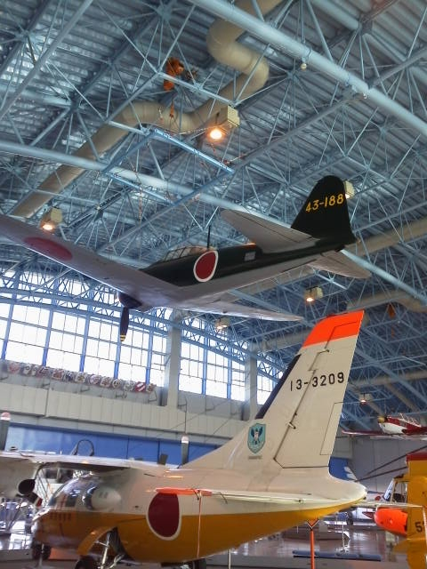

---
title: "航空自衛隊浜松広報館（エアパーク）のゼロ戦"
date: 2014-01-18 09:24:06
category: "旅行・地域"
---

先日、大好きな「撃カレー」が欠品したので、浜松空自の広報館に補充に行ってまりました。

とりえず６箱購入しまして、そのまま帰るのはもったいないので、展示館の方にあるゼロ戦を撮影してきました。

このゼロ戦、本物（引き上げた機体をレストアしたもの）だったんですね。余りに綺麗なので、レプリカのガワだけのものかと思っていました。（ほとんど作り直しなのでしょうが、それでもベースが本物かどうかは非常に重要。）

　

&nbsp; 

　

<a href="https://nyargo1971.github.io/nyargos-blog/">ブログトップ</a> | <a href="http://www4.tokai.or.jp/nyargo/html/ano19.html">エクセルで競馬</a> | <a href="http://www4.tokai.or.jp/nyargo/">本家WEBサイト</a>

