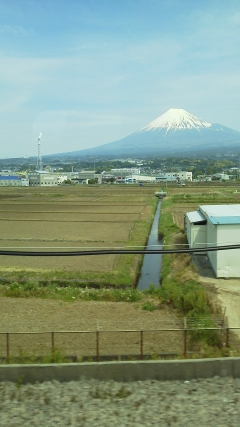

---
title: "新幹線のテレビを見たら"
date: 2014-05-11 14:59:56
category: "旅行・地域"
---

5月10日の夜に、新幹線の特集番組がありました。

観ていたら、どうしても新幹線に乗りたくなってしまい、急遽日曜日に出かけることにしました。

目的は、あくまでも新幹線に乗ること。

でも、目的地が無いのもあれなので、伊東のあげまんを買いに行くということにしました。

おまけの富士山(富士市あたり）

電車から撮るのは難しいですね。結構な率で電柱が入ってしまうので。

&nbsp;

（蛇足）

以下、気持ち良くないことが書かれているので、読まない方が精神的によろしいかと。

さて、時間にして５時間弱の旅程の間に、横入り2回と、グリーン車の不正通行1回を見てしまいました。

最近は、この手のことをするのって、いい年こいた大人が多いんですよね。決して若年層ではない。

静岡では、電車だけじゃなく、車に乗っている時でも、右折専用矢印信号が出ているのに、直進や左折する車が結構います。

共通して思うのが、「その少しの時間を稼いで、いったい何が得になるのか？」ということです。

&nbsp;

<a href="https://nyargo1971.github.io/nyargos-blog/">ブログトップ</a> | <a href="http://www4.tokai.or.jp/nyargo/html/ano19.html">エクセルで競馬</a> | <a href="http://www4.tokai.or.jp/nyargo/">本家WEBサイト</a>

