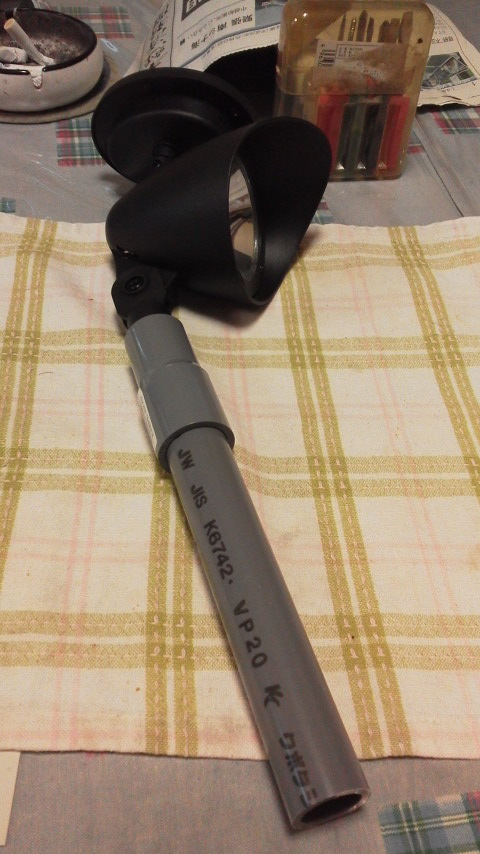

---
title: "プチ太陽光屋外照明"
date: 2014-07-14 19:55:10
category: "旅行・地域"
---

職場で、遅番の方から夜遅く帰るときに暗い通路があって怖いという悩みがでて、懸案になりました。

そこは屋外なので、簡単には電気配線は伸ばせません。埋設となると費用がべらぼうに上がりますし、露出なら比較的簡単ですが、美観や安全上の支障が出ます。

一昔前なら、懐中電灯を持てばいいじゃん、の一言で済んだようなことですが、今は夜でも明るいのが当たり前のような世の中ですからね。何とかできないものかと考えてみました。

そこで、太陽光発電による自立型照明器具は設置できないかと思い立ちました。

ただし、本格的なものは1基40万～とお高く、とても予算内で設置できません。そこで通販やDIYショップで売っている簡易の庭灯なら安いので、それが何とかものにならないかと調べてみることにしました。

まず、これらを評判をネットで調べてみると、かなりの悪評です。

曰く「暗い」「すぐ壊れる」等々、いきなり経費で購入するのは難しいと判断しました。

そこで実用に耐えられるか試してみようと思い、近所のDIYショップで自腹で材料をそろえ、試作品を組んでみました。

&nbsp;

■目標

・照度…照明器具としての照度。絶対的に足りなければ、数を並べて、少なくとも誘導灯程度には使用でき、夜間に遠目で視認できること。

・耐久性…電池交換は1年に1度程度。ネット上では、電池の評判も悪いので、そこだけいい製品に換装することも想定しています。交換手間を考えれば、電池を驕っても問題なし。本体の耐久性が高ければの話ですが。

・経済性…手間賃抜きで1セット1,000円を切ればゴールデンマスターでしょうが、それは難しそうなので、個人工作レベルでまずは1セット2,000円を限度に、最終的には1,500円を切れば良しとしたいです。

&nbsp;

■プロトタイプ01

とりあえず一番安いタイプを購入してきて、ざっくりと作ってみました。

こんな感じです。

通常のVP管です。

VP20と異径ソケットの組み合わせで、繋げられます。多少ゆるさがありますが、パテや接着剤で修正可能な範囲です。

ポイント～異径ソケットでつなぐ。相性はDIYショップで現物で試すのが一番です。私は、通常のVP20（２ｃｍ径）塩ビ管を20*16の異径ソケットでつないで、照明側が少しゆるいので、パテと瞬着でカバーしました。

&nbsp;

■ゴールデンマスターはまだ遠い

耐久性はこれから悪天候下に置いておいてどうなるか？という面がありますが、もし電池の面だけなら、高性能の電池を使用するなどすればいいわけで、交換の手間を考えれば多少の電池の単価など気になりません。

問題は照度でしょうね。

はなから通常の照明器具クラスの照度は期待していませんが、段差の視認や防犯的な面で、最低限度必要な照度が確保できないなら、やはり誘導灯としての利用にしかできないということになってしまいますが。

実際の利用者が、最低限どの程度の明るさを確保したいかによります。

&nbsp;

なお、この記事を検索で見つけられた方向けの注意点。

当たり前ですが、夜中あまり明るいと、羽虫がわんさか集まってくるわ、それを狙うクモが網を張るわ、といったマイナス面も生じますのでご承知おきを。

&nbsp;

