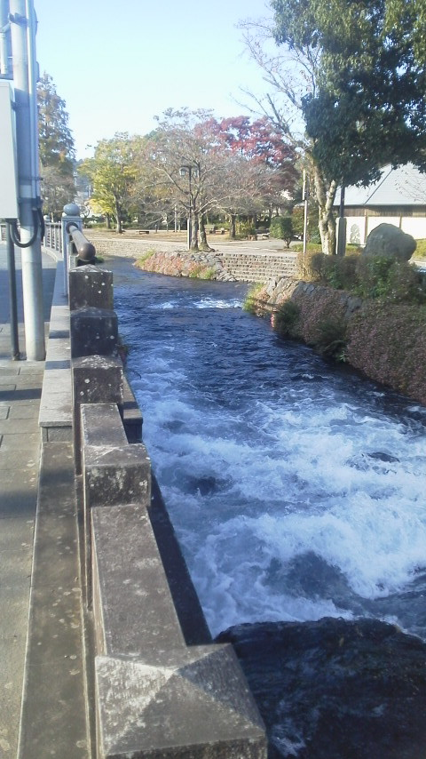
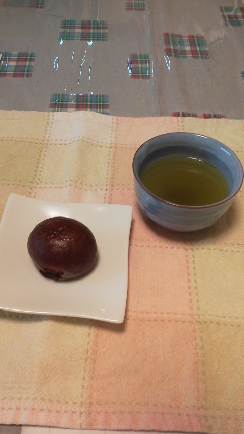

---
title: "富士宮の富士山本宮浅間大社に行ってきました"
date: 2015-10-25 11:17:58
category: "旅行・地域"
---

秋晴れの良い天気の中、富士宮の浅間さんにお参りに行ってきました。

ものすごい水量です。

集めて速し、ではなくすべて神社の湧水だけでできている川。

しかも「１級河川」！

&nbsp;

◆朝の浅間さんは最高でした

もっとも神霊に触れられる時間かもしれません。

&nbsp;

観光で訪れていただくような場合で、もし近くで一泊されるようなら、朝食前の散歩でぜひ散策してみてください。

&nbsp;

◆交通案内

車でのアクセスは、<a href="http://www.fuji-hongu.or.jp/sengen/index.html">浅間さんのホームページ</a>、<a href="http://www.city.fujinomiya.shizuoka.jp/fujisan/llti2b0000001lsq.html">富士宮市の駐車場マップ案内</a>または<a href="http://www.fujinomiya.gr.jp/">観光協会のホームページ</a>で御確認ください。

境内の周囲に第１、第２駐車場があります。

&nbsp;

県外者用の駐車場として、近年、無料のせせらぎ広場駐車場も整備されました。

これは、富士宮駅から北に道なりに行くと、道沿いに駐車場入口を示す大鳥居があって場所はわかりやすいのですが、交差点過ぎの信号無し右折となるため、幹線道の混雑時は入りづらいかもしれません。

お茶請けは、昨日稲取へ行った帰りに途中下車して買った、お約束の伊東駅前にある<a href="https://nyargo1971.github.io/nyargos-blog/sitemap.md">みそののあげまんじゅう</a>です。

&nbsp;

