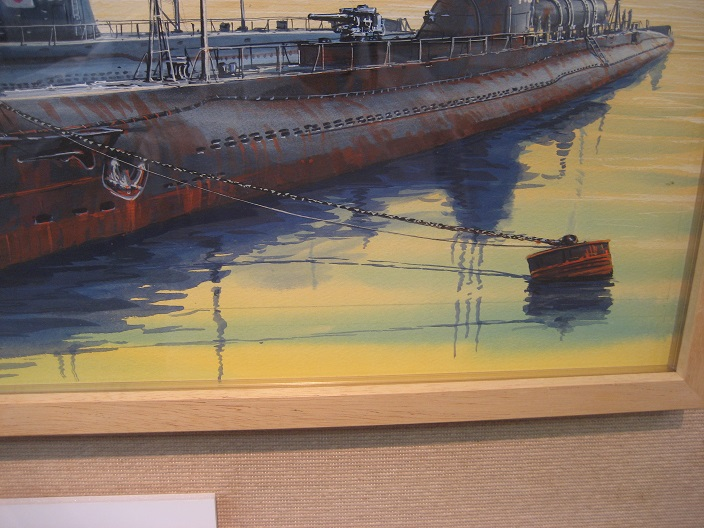

---
title: "上田毅八郎の描く水面表現"
date: 2016-10-07 18:13:52
category: "旅行・地域"
---

上田毅八郎追悼展にいってきました。

＠静岡ホビースクエア

2016年10月1日（土）～2016年10月9日（日）

1人500円

★追悼展は撮影自由☆

<a href="http://hobbysquare.jp/">静岡ホビースクエア・ホームページへのリンク</a>

（1973年発売　伊-16・伊-58）

夕闇が迫る前のひとときでしょうか。不思議な水面が現れた一刻を切り取ったような表現

&nbsp;

&nbsp;

なお、上田毅八郎氏は、従軍中にケガをして「右手・右足」に障害を負って、左手でこれらの絵を描いています。絵を描くときは、戦友の鎮魂を思って描く、と述べていたそうです。

&nbsp;

