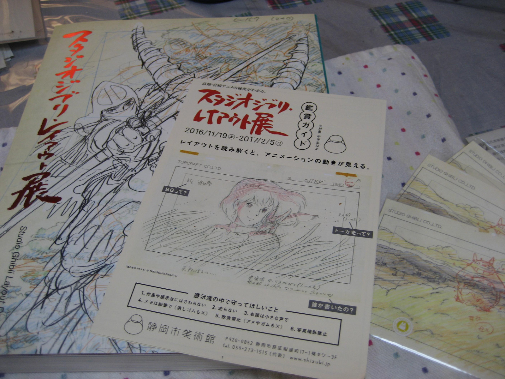
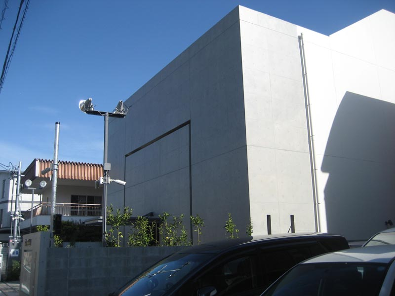
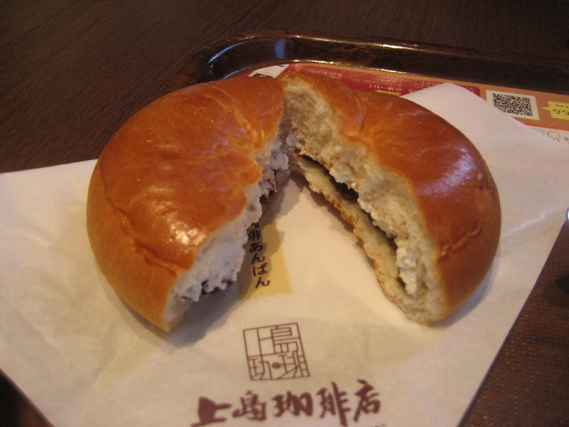

---
title: "静岡市美術館（スタジオジブリ・レイアウト展）と静岡近代美術館（未）に行ってきました"
date: 2016-12-04 15:58:40
category: "旅行・地域"
---

&nbsp;

■スタジオジブリ・レイアウト展

静岡市美術館で、現在開催中の展示に行ってきました。

レイアウト展のブック、絵葉書と市美術館のパンフ(パンフは無料)

※市美のパンフには、レイアウトというものについての解説が載っており、これが素人にも大変分かりやすく書かれているので、絶対に貰って帰るべきです。

&nbsp;

◆名場面のレイアウトがいっぱい

名場面のレイアウトが結構あって、内容が充実しています。

ジブリファンなら必ず見るべし。

&nbsp;

私は、紅の豚の名台詞、

（ポルコ）「飛ばねえ豚はただの豚だ。」

（ジーナ）「バカっ（ガチャン）」

の電話のやり取りのシーンが、”上下に並べて”展示されていたのを小粋に感じました。

&nbsp;

◆注意点（子供連れで行こうと考えてる方々へ）

見るのにすごく時間がかかるので、小さい子どもは連れて行かない方がいいかもしれません。

その理由は以下のとおりです。

&nbsp;

・まず、作品展示の高さが、大人の身長に合わせたものになっています。小学校低学年以下くらいの子どもには、ちょっと高すぎる位置です。

・最初に書いたとおり、レイアウトとは鉛筆画、または色鉛筆画で、それが延々と並んでいるだけです。アニメの色鮮やかさは一切なし！あくまで資料画です。ナウシカから生で見てきたくらいのアニメオタクおっさん世代向けの展示、と割り切っておいた方がいいくらいです。

・いったん入場すると休憩所やトイレはありません（ソファが少しだけ）。見て回るのに時間が掛かるので、子どものトイレは必ず先に済ませておいた方がいいと思います。同じ3階にあるトイレは広めです。

・暖房が利いているのと人の多さのコンボで、のぼせてしまうかもしれませんから、子どもの様子（顔色が上気していないか）には注意した方がいいです。

・アニメオタクが、１つのレイアウトの前に５分くらい居座って列の流れを止めていることがあります。律儀に順番を待たずに、そこだけは無視して追い抜いていった方がいいです。奴らは自分の気が済むまで動きません。

&nbsp;

★もし、子供を連れていく場合は

家を出る前(前の晩)に、一番観たい作品は何かと子供に聞いておき、入場後は、まずその作品のブースを見に行く、という作戦がいいかも。

（ブースは作品順・年代順にまとめられています）

<a href="http://www.shizubi.jp/">静岡市美術館</a>

&nbsp;

■静岡近代美術館

静岡の西草深（お堀：静岡城公園）の西側にオープンした静岡近代美術館のところまで行ってきました。

微妙な言い回しな理由は、この後で分かります。

&nbsp;

◆静岡近代美術館への行き方

付属駐車場もありますが、広さの問題から、市民体育館の有料駐車場（お堀の北東）に止めた方が気楽だと思います。

お堀の周回路の西側エリアにあるので、まずはお堀西側の向かいにあるNHK静岡の建物を目指します。

NHKの角を西側住宅街の方に曲がります。

※美術館の建物の外観

建物には目立つ看板は出ていませんが、実は、ここまでの電柱に「→（矢印）近代美術館」という道しるべが出ているので、歩きなら、そう迷うことはありません。

&nbsp;

◆土禁です

ただし、この美術館、「土足禁止」でした。

スリッパを貸していただけるので、普通なら、履き替えて入場することができますから、ご心配なく。

ただ、このルールを知らず、当日私は（ケガした足を保護するように）ガッチリしたブーツを履いていってしまったのです。

今日は入場を断念。せっかくスーツ着て行ったのに…orz。

車イスの人とかにはどう対応するんだろう？

<a href="http://shizuoka-kinbi.jp/">静岡近代美術館</a>

&nbsp;

■おまけ（上島珈琲店で軽食）

お昼がわりの軽食を、東静岡駅南口の上島珈琲店でいただきました。

番組で薦められていたあんぱん(250円！)

この中には、生クリームとコーヒーで煮たというあんこが入っています。

食べると最初は生クリームの味が広がるのですが、あとから餡の中からコーヒー風味が上がってきます。

番組ではコーヒーと一緒に食べるのをおすすめしていた感じでしたが、単体で食べた方がいいかもしれません。

コーヒーを飲んじゃうと、飲んだコーヒーの方の味が強く残るため、アンパンの方のコーヒー風味を感じ取れなくなりました。

買って帰って、うちで、例えば牛乳とかと組み合わせた方が、かすかなコーヒーの風味を生かせると思います。

&nbsp;

