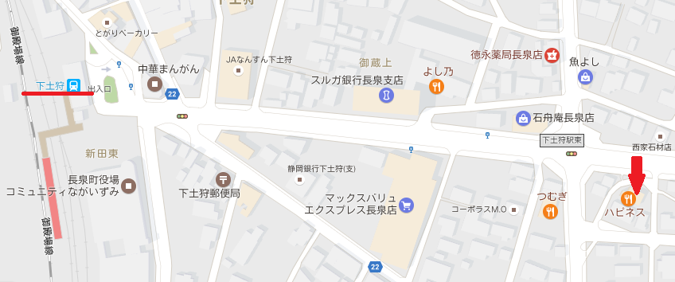
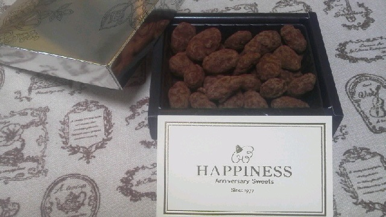

---
title: "長泉のスイーツ屋さんで柿のロールケーキを買ってきました"
date: 2017-01-21 16:49:28
category: "旅行・地域"
---

今週水曜にTVのローカル旅番組で紹介されていた「柿のロールケーキ」を買ってきました。

また、長泉町はとなりのJR三島駅(新幹線駅)にもほぼ接しており、(お店でもらえる名刺にもあるとおり)三島駅から徒歩１５分と立地がとてもいい場所でした。

<a href="http://happiness1977.com/index.html">アニバーサリースイーツ HAPPINESS</a>

&nbsp;

◆柿のロールケーキ

四ツ溝柿のロールケーキ １，３５０円（税別）

（大きさ比較用のお店の名刺と一緒に撮影）

&nbsp;

こちらは帰宅してすぐに包装を開けて、一つだけパクッ。

ドラジェはアーモンドの固さもポイントで、好みにもよるのでしょうけれど、これはいい感じでした。

カカオの味は、ビター寄りでもなく、かといって甘いタイプでもなく、ちょうど良くアーモンドとカカオの風味を楽しんでもらおうという意図があるかもしれません。

お茶とよく合う軽いお菓子となっています。

&nbsp;

…って気が付いたら半分以上摘まんでいました。

ヤバイ１回で食べきってしまっては。食べ続けたい気持ちをグッと我慢して、すぐに包装しなおして冷蔵庫に仕舞いました。

&nbsp;

