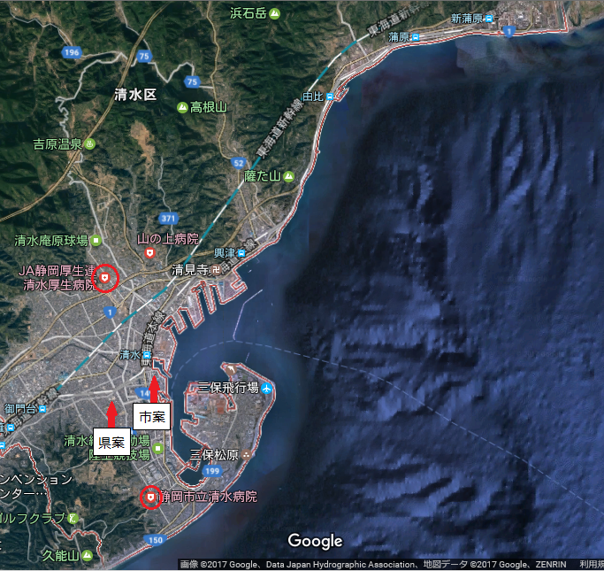

---
title: "1／９９９（清水区病院移転問題）"
date: 2017-03-14 23:57:35
category: "旅行・地域"
---

清水区病院（桜ヶ丘病院）移転問題に思う。

&nbsp;

地方版ニュースで連日のように報道されていた清水区病院移転問題。

県知事(川勝氏)と(自治権をもつ政令指定都市の）静岡市長(田辺氏)の、移転先の防災機能に関する見解が異なり、かつ二人が犬猿の仲だったため、マスコミに大きく採り上げられました。

県内TVのマスコミは、どちらかというと県知事よりのコメントでしたので、念のため、地元民の立場から見た、別の見解も述べておこうと思います。

なお、結果的に市長案を推す形になりますが、実は私、両氏とも好きではありません。

&nbsp;

【清水区全域図】

まずは、静岡市清水区の地図で、いわゆる総合病院（内科・外科手術が可能な大きな病院）の配置をご覧ください。

清水区全域図(山間部を除く)

※googleマップを利用いたしました。

これらは上図のとおり、旧清水市内の北・中・南にきれいに配置されています。

※加えて蒲原地域にも救急受け入れ病院があります。

このことにより、どの地域で事故等があっても対応しやすくなっています。

（ただ、私が昔事故った時には、○○病院だけはやめてくれ、あそこへ行ったら殺される、と救急隊員に懇願しましたが。）

多すぎかどうかは別にして、散らばり具合は、旧静岡市よりよほど良いと思っています。

&nbsp;

今回移転先が問題になっているのは、「中」に位置する桜ヶ丘病院の行き先ですが。

交通事情から、これは、圧倒的に「市案」の勝ち。

（１）電車事情

JR清水駅に近く、北側にある興津・由比・蒲原地域からの通院に便利です。

また、しずてつバスに協力してもらって、乗務員OBによるマイクロバスを清水駅港口からピストン運航してもらうとか、いわゆるドリプラシャトルバスの低床化＆利用など、市が事業支援措置すればさらに便利になります。

一方の桜ヶ丘地域は、静岡市民ならだれでもご存じのとおり、静鉄電車から近いのですが、しずてつ新清水駅とJR清水駅とが接していないので、意味がありません。葵区側には総合病院がいっぱいあるので、そちらからの流入は考えなくても構いませんし。

（２）バス事情

現在の清水区庁(旧清水市役所)は、特別、便利なバス停というわけではありません。

清水区では、ほぼ全てのバス路線が、「JR清水駅」を目指して走っているので、ちょっとずれているのです。

それでも、三保、大坪といった住宅街が多い地域から複数の直通路線が通るので、本数の不便感はありません。

一方の桜ヶ丘ですが、現行では…大坪で曲がる路線１本になるのかも。

これは、いずれのケースでも、もし病院ができれば増便もあると思われますが。

（３）道路事情

接する道路の渋滞事情が違います。桜ヶ丘の前の道路は、通称「南幹線」で、朝夕は渋滞します。裏手は住宅街で生活道路のため、回避路はありません。

一方の現行清水区庁舎は通称「さつき通り」で、同じく渋滞しますが、裏に港湾道路がとおっており、さらに中道も２本あって、道路選択に余裕があります。

&nbsp;

このように、清水区民全域の日常利用を考えた場合、まんべんなく便利なのは、清水庁舎に分があります。

（そりゃそうです。旧市役所が不便なところにあるはずがありません。）

&nbsp;

【さいごに】

テレビで知事やコメンテイターが言われているとおり、港湾部にある現行区庁舎に病院が建った場合、津波が来た時には、確かに病院の建物にも被害があるかもしれません。

しかし、病院以外にも、商業ビルや駅や商店街や家々もたくさんあるわけです。

『市案は津波浸水区域だから危ない、全くダメだ。』ではなくて、港や巴川と一緒に生きている以上、”危ないのはそこだけじゃない”んだから、そういったことも考えたうえで、言葉を選んでコメントしてほしいです。

今回の移転騒動だけをことさら取り上げることの無意味さ、想定外とか想定内とかいう言葉がいかに無意味か。

昔からの清水地域には、そこなりの危険が、（これまで人が住んでこなかった）新興住宅地等には、そこなりの危険が、潜んでいるということです（※）。

※ちなみに私が調べた自分のケース。

出自は三保なので、そこは当然津波の危険。

そして現在の住居の場合は、地盤が弱く（地震に弱い）、津波が手前の岡地形を越えてくると水が引かない皿の底地形、ということが分かりました。また、地震の揺れで生き延びることができたら、そのあと逃げる場合は有度山がいいということですが、急傾斜地(山崩れの危険)もあるため、どの道を通ってどこ（高さ）まで行くかは迷い中です。

&nbsp;

本気で最大被害を算定し、自衛したければ、地域史から学ぶに如かず、です。

御自分の住んでいる地域の歴史を調べてみること、どんな危険にどう対応すべきか（何を持って・どちらの方角に・どの程度・逃げるべきか）具体化してくるかもしれません。

なお、地域史は地元の有志が編纂されていますが、発行部数が少なく重版もほぼないため、素人がタイムリーに地元の書店で手に入れられるケースは少ないです。

しかし、たいてい公立図書館等には寄贈されているはずなので、そちらで借りるのが早道です。

