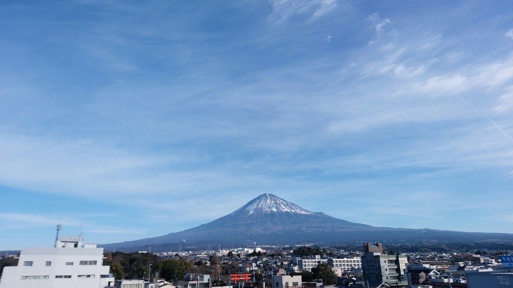
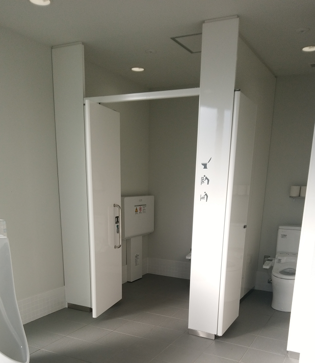
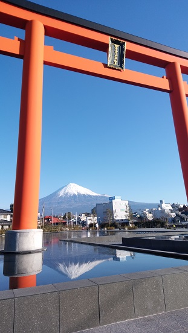

---
title: "富士山世界遺産センター（静岡県）に行ってきました"
date: 2018-01-07 16:34:20
category: "旅行・地域"
---

静岡県富士山世界遺産センターは、その建物の前に大きな人工池が配されており、晴れていれば、逆さ富士が誰でも撮影できる絶好の撮影スポットになっています。館内を５階まで登りきると、そこにはパノラマで富士山が拝める展望台が(しかもガラス越しじゃなく)、待っています。

浅間大社、そして商店街でのお食事や買い物と、セットで行ってみてもらいたいスポットです。

ただちょっと駐車場へのアクセスが分かりにくかったので、そこらへんをこのブログでは掘り下げてみました。

&nbsp;

・センターの外には多様な撮影ポイントが

・センター内の概要

・公式駐車場への行き方は？

・喫煙所はある？

・おすすめトイレはここ！

&nbsp;

１月７日（日）、３連休の中日に<a href="https://mtfuji-whc.jp/">静岡県富士山世界遺産センター</a>に行ってきました。

５Fということで遮蔽物も少なく、ガラス越しでもなく、富士山が見通せる場所って意外とないんですよ。

&nbsp;

<strong>あっ、そうか。この建物は『富士塚』だったんだ。と遅まきながら気づきました。</strong>

&nbsp;

富士塚であるなら、このただグルグル回って上がるだけのスロープにも「意味」が生じます。

富士塚であれば登り切ればご利益があるからです。

<a href="https://ja.wikipedia.org/wiki/%E5%AF%8C%E5%A3%AB%E5%A1%9A">富士塚とは？（外部リンク）</a>

※家に帰ってから入口で貰ったパンフレットを読んだら、『らせんスロープでの疑似登山体験を』とちゃんと書かれていました。

&nbsp;

<strong>◆降りながら展示物を見学</strong>

５Fのトイレは使用中だったのであきらめて、下りスロープへ。

帰りはゆっくり階ごと用意されている展示物を確認しながら降りていきます。

&nbsp;

３Fの展示、富士山絵画の画像集（タッチ式サイネージ）は、触って調べられるおすすめ展示物です。  

大便用には、「多機能トイレ」もしっかりありました。これは現代公衆トイレでは重要なポイントですよね。

もちろん全体がバリアフリー。ただし、車いすがダブるときには行き来に気づかいする程度の幅だと思います。

まさに、いたせりつくせりのトイレ。

&nbsp;

&nbsp;

それでは、お気を付けて富士山世界遺産センターへお越しください。

そして「富士塚」登頂で、ご利益がありますように。

（運良く晴天であることをお祈り申し上げます。）

リンク：<a href="https://mtfuji-whc.jp/">静岡県富士山世界遺産センター</a>

&nbsp;

◆<strong>番外編（帰り道の国１バイパス：蒲原付近）</strong>

上記記事はいかがだったでしょうか。以下の記事は番外編です。

この記事の最初の方にある、先週（７日）に撮影した写真と同じアングルで撮影してみました。

雪の白さに違いがあるのがわかるでしょうか？今週の方が厚く積もっているので、白色が強いんです。

&nbsp;

