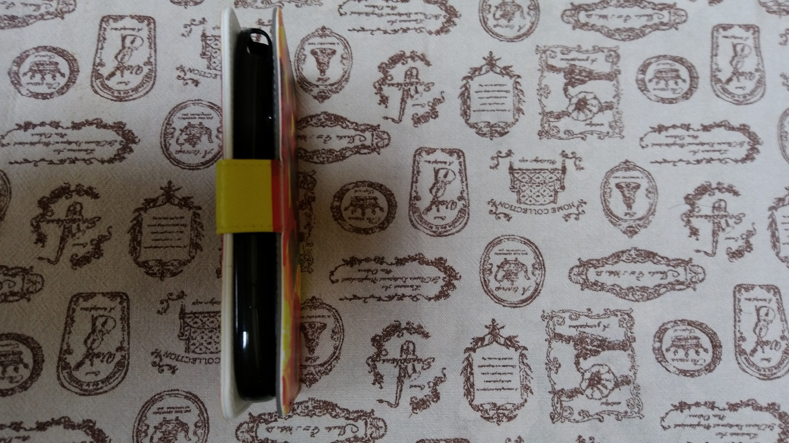

---
title: "手帳型スマホケースをカスタムしました２"
date: 2018-04-07 22:10:49
category: "旅行・地域"
---

<a href="https://nyargo1971.github.io/nyargos-blog/sitemap.md">以前の記事</a>で、手帳型スマホケースを新調したことと、その際ケースのカスタムをしたことを書きました。

今回、叔母にスマホケースをプレゼントすることになりました。

手帳型のスマホケースは、またまた<a href="https://www.creema.jp/item/3653331/detail">ちょぼさんの一品</a>で、叔母の好きなツバキの花柄のもの。

前回の私の携帯ケースと同じカスタムをした上でお渡しするので、以前の記事では省略してしまった、内側カバーの取り付け方を、もう少し詳しく画像付きで説明することができます。

&nbsp;

スライドタイプの手帳型スマホケースのカスタム

スマホを直接貼り付けるよりもスマホカバーの分だけ厚みが増しますが、問題はありませんでした。

再来週に叔母に会いに行くので、渡すのが今から楽しみです。

&nbsp;

