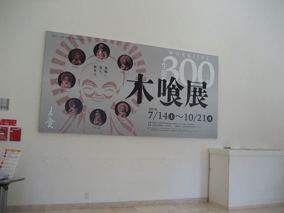
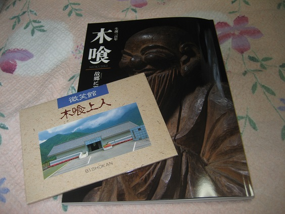

---
title: "木喰展（もくじきてん）に行ってきました"
date: 2018-09-24 15:36:38
category: "旅行・地域"
---

9月23日夜9時、NHKの日曜美術館で放送された木喰上人の彫刻（再放送）に感銘を受け、

山梨県身延町にある「なかとみ和紙の里」内の「なかとみ現代工芸美術館」で開催されている「木喰展」に行ってきました。

（開催期間：2018．7．14～2018．10．21）

&nbsp;

今日行ってきた２館とも展示場内撮影禁止だったため、ブログ内に彫刻の写真はありません。身延町等の公式HPに記事がありますので御参照ください。

<a href="https://www.town.minobu.lg.jp/bunka/rekishi/300mokujikiten.html">木喰展</a>記事はこちら（記事のリンクに期限があります）

<a href="https://www.town.minobu.lg.jp/washi/">なかとみ和紙の里</a>はこちら

<a href="https://www.town.minobu.lg.jp/kanko/annai/midokoro-mokujiki.html">微笑館</a>はこちら

<a href="http://www.yamanashi-kankou.jp/kankou/specialty/p7_6981.html">道の駅しもべ</a>はこちら

&nbsp;

◆展示品について

テレビでも紹介されていました「地蔵菩薩」のほか、小品ですが「不動明王」、（集落の子どもたちに”ソリ”遊びで使われたため）顔部分が削り落ちた「自身像」の仏像などが８０点。

テレビでも言われていたとおり、普段は全国の所有者の元に散らばっているので、一堂に見られるこの機会というは大きなチャンスで、行って来て良かったぁと感謝。

木喰上人の仏像を掘り起こしたと言える、大正時代の民芸活動家柳宗悦さんと木喰さんの子孫の伊藤さんとの手紙のやり取りなども展示されており、大正時代に光を浴びなおした経緯も分かります。

&nbsp;

比較的、「薬師如来」と「不動明王」が多い気がします。

求められるまま仏像を彫ったとすると、江戸時代はやはり現代の医療事情からは想像できない病気・悪疫に対する畏れ、というものがあって薬師如来や不動明王が求められたのでしょうか。

&nbsp;

◆木喰展が終わった後は

１０月に木喰展が終わると、展示品は全国に散らばる元の所有者のもとに帰ります。

出身地の身延町で木喰上人のことを知りたい場合は、下部（しもべ）地区にある「木喰の里微笑館」があります。

今回、こちらも行ってきました。

童話に出てくるような小さな展示館(田舎の公民館くらい)で、収蔵品も多くはありませんが、本物が１体ありました。行けば確実に拝むことができます。

ただし、この館へのアクセスが極めて不便。道を間違えると山中で迷います。（カーナビがあれば問題ないのでしょうが）

&nbsp;

◆各会場へのアクセス

公共交通機関で訪ねる場合はJR身延線となります。

車の場合は、太平洋側なら第２東名、甲府経由なら中央道経由となります。

今日は、第２東名経由で行くルートで紹介します。

&nbsp;

第２東名の静岡県「新清水IC」を降りるとそこは、清水区と甲府市を結ぶ国道５２号線です。

出口のところにある交差点を左折すると、北側・山梨県側へと行けます。

木喰展会場でカタログ（２，０００円）

微笑館で絵葉書セット（５２５円）

をそれぞれ購入しました。（価格は２０１８年現在）

&nbsp;

