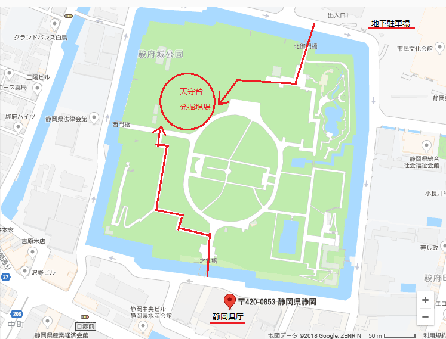

---
title: "2018/10/28 金箔瓦出土　駿府城本丸跡"
date: 2018-10-28 21:32:01
category: "旅行・地域"
---

豊臣時代に秀吉家臣の中村一氏が城主を務めた天守閣に使われたとみられる金箔瓦が大量に出土した駿府城址。

現況はどうか見に行ってきました。

&nbsp;

発掘現場の様子

そのうち、金箔瓦が公表されるとのこと。その瓦が公表されれば是非見に行きたいことですが、「どこから」出土したかという現地を見ることも歴史好きには欠かせない道程。

場所は、駿府城址内なので分かりやすいです。

県庁の裏側(北側)に行くと石垣沿いにお堀(内堀)が渡っているので、南側に唯一掛かっている橋を渡って公園内に入ります。

案内図を見ながら歩いてもらえれば辿り着くのですが、北西側（左前方）に進む感じで散歩していると辿り着きます。

直接車で来る場合は、北側の体育館・演芸ホール用地下駐車場があるので、それを使ってもらい、北側に唯一ある橋を渡って公園内に入ってもらうと、右前方に工事現場らしきものが視界に入ってきます。

2018年10月現在、発掘現場は工事フェンスで囲まれています。  　

今日は、スマホを片手にウロウロしている人たちが異常に多く、お堀の周りには、いつになく違法駐車も多かったです。

きっとポケモンのレアモンスターか何かが期間限定で登場していたか何かだと思います。

&nbsp;

さらに穿ってみれば…

任天堂さんに県が頼んで、この発掘現場アピールのために、レアモンスターの出現させてもらっていたのかも。

SNSとかにアップしてもらえれば儲けものとか。

なぜなら、普段ならこのお堀周りの違法駐車って、普段なら県警パトカーがめっちゃ厳しく取り締まりしている場所なので。

きっと今日は、県公安委員会も県知事部局からの協力要請を受けて、現場の警官は上からの命令で見逃していたんじゃないか、としか思えないんです。

