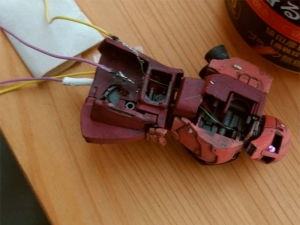

---
title: "MS-05 シャア専用旧ザクを作る（頭部とモノアイについて）"
date: 2019-10-18 22:06:17
category: "旅行・地域"
---

　

<a style="color: #ff0000;" href="https://nyargo1971.github.io/nyargos-blog/2019/09/post-4cfe40.html" target="_blank" rel="noopener">元の記事（シャア専用旧ザク総合）</a>

　

<strong>頭部モノアイと胴回り</strong>

　

知ってる人には当たり前のことなんでしょうが・・・

いろいろと失敗しました　orz。　

 

【失敗その１】

マルツで販売している中では、チップ型を除いて、もっとも小さなLEDを買ってきました。

それでも、モノアイ部分の切り欠きに収まりませんでした。また、配線も別パーツに干渉してしまいそうです。

なお、チップ型にすれば入りそうですが、私の技術では、逆に小さすぎることで扱い切れない。結線や取り付けで手が攣りそう。なので避けました。

トライ＆エラーを繰り返すより、ここだけはこのガンプラ専用ユニットを使った方が結局は安上がりかと見切りをつけました。

　

結局、駿河屋で専用ユニットを購入。

ＬＥＤ　チップ型　配線付き

　

点灯した！

