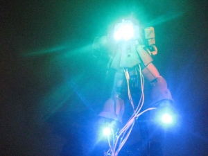

---
title: "MS-05 シャア専用旧ザクを作る（足部について）"
date: 2019-10-18 22:06:58
category: "旅行・地域"
---

　

<a style="color: #ff0000;" href="https://nyargo1971.github.io/nyargos-blog/2019/09/post-4cfe40.html" target="_blank" rel="noopener">元の記事（シャア専用旧ザク総合）</a>

　

<strong>足裏部バーニア</strong>

　

今回最大難関かもしれません。

脚部を通す配線経路がどうしても見つけられませんでした。

　

