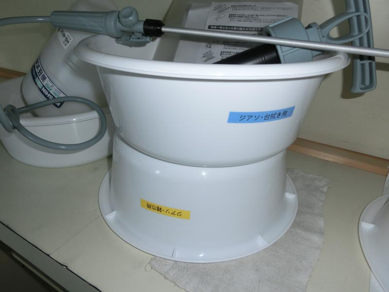

---
title: "０．０５％ジアソの作成手順 例の紹介"
date: 2020-04-16 07:45:31
category: "旅行・地域"
---

※新型コロナ対策関係記事　

<a href="https://nyargo1971.github.io/nyargos-blog/2020/04/post-45f5a1.html" target="_blank" rel="noopener">◆当ブログ内の新型コロナ関係まとめ記事</a>

　

　

◆実際の０．０５％ジアソの作成手順例の紹介

　

（注：実際に作る場合は、この記事の飛ばし読みは避け、熟読をお願いします）

　

<strong>最終的に使ったもの（買いそろえたもの）</strong>

・色抜けしても構わないエプロン、作業衣料【３着】

・ゴム手袋【３双】（作業するので極薄や厚手は避ける）

・布マスク【３枚】（手作り布マスク）

・雑巾【６枚】（台拭き用・ドアノブ用　各３）

・洗面器【４個】

・ジアソ【１本】（ここでは花王のハイターを使用）

・霧吹き【１本】（ここでは霧吹くんと日本製ペットボトルを使用）

・漏斗【１個】

・小さじ計り【１個】

・１Ｌ有色ボトル（使いきりなら透明ボトルも代用可）

・メモ書き用 油性マジック【１本】

　

※感染が確認された区域では、日常装備不可

　さらなる防護装備が必要になります。

　<a href="https://nyargo1971.github.io/nyargos-blog/2020/04/post-45f5a1.html" target="_blank" rel="noopener">まとめ記事のページ</a>の「防塵マスク」の項参照のこと

　

<strong>作業前の準備</strong>

塩素は、漂白作用があるのと手・肌を荒らすので、色落ちしても構わない作業服と大きめのエプロンとゴム手袋が必須です。

この装備は、消毒作業が終わるまで、ずっとその服装のままで。

消毒が終わって道具の洗い物・片付けも済んで、そして一番最後にゴム手袋を外す手順になります。

　

それと、もし作業中に液が跳ねて目に入った場合は、すぐに大量の水道水で目をすすぐこと。

（このシチュエーション、意外とあります！）

　

<strong>ハイターを０．０５％に希釈</strong>

ジアソ希釈液を作ります。

ドアノブへの噴霧や雑巾に吹き付けての作業だけなら、１００ｍLもあれば十分です。

しかし、実際には消毒に使った雑巾などを「漬け置き洗い」するための分も必要になります。

このため、最低でも１Lは作っておきます。できれば２L以上。

※洗面器にも、雑巾用か布きん用か分かるように書いておくといいです。

　

私は雑巾・布きんを計8枚程度準備、ゴム手袋もとりあえず2セット、洗面器も4つ準備しました。

十分に陰干しして、乾かす期間が取れるようにするためです。

保管スペースの問題は生じますが。

　

とにかく『いろいろと共用しないこと』は、感染リスク低減のためには良いことだと考えています。

　

【再掲：参考ＷＥＢサイト】

　

※ジアソ濃度の根拠にした厚労省のリーフレットのアドレスは以下のアドレス、または「厚労省・コロナ・ハイター」で検索

<a href="https://www.mhlw.go.jp/content/10900000/000614437.pdf" target="_blank" rel="noopener">https://www.mhlw.go.jp/content/10900000/000614437.pdf</a>

　

※ハイターの製造元の花王のＷＥＢサイト～ジアソ濃度の混合比についての回答

<a href="https://www.kao.com/jp/soudan/topics/topics_107.html" target="_blank" rel="noopener">https://www.kao.com/jp/soudan/topics/topics_107.html</a>

　

※東京都健康安全研究センターのページで、新型コロナがどの程度の時間、安定性（感染性）を維持しているかの知見

（マジですか。結構長生きしています）

<a href="http://www.tokyo-eiken.go.jp/lb_virus/corona-bunken/ncorona-shoudoku/" target="_blank" rel="noopener">http://www.tokyo-eiken.go.jp/lb_virus/corona-bunken/ncorona-shoudoku/</a>

　

 

