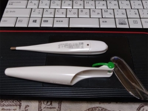
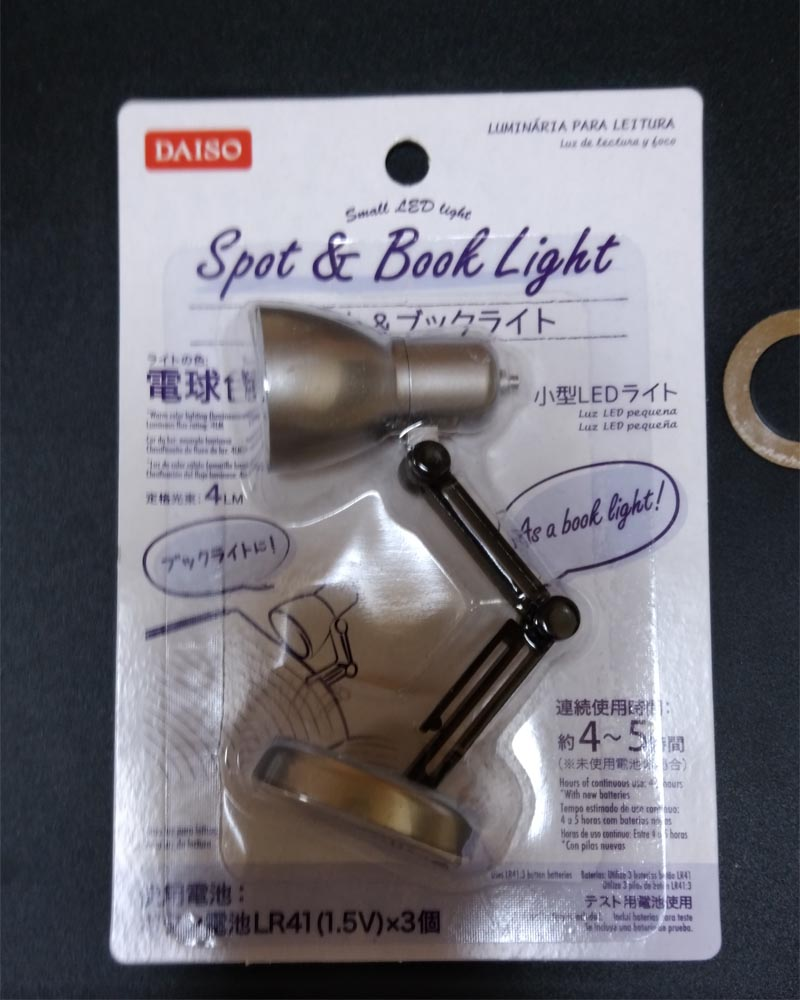

---
title: "手持ち電子体温計の電池種類などを確認しておく（テルモＣ２３１　リチウム電池LR41）"
date: 2020-04-16 09:10:03
category: "旅行・地域"
---

※新型コロナ対策関係記事

<a href="https://nyargo1971.github.io/nyargos-blog/2020/04/post-45f5a1.html" target="_blank" rel="noopener">◆当ブログ内の新型コロナ関係まとめ記事</a>

　

　

<a href="https://nyargo1971.github.io/nyargos-blog/2020/04/post-5028bc.html" target="_blank" rel="noopener">◆その２では、100円ショップのテスト用ボタン電池で体温計が何回使えるかトライ始めてます</a>

 

電子体温計や、その電池不足が話題になりました。

それ自体は、どうせ買い占めネタなので、踊らされてたまるかという気持ちですが、実際に交換電池が無いと困るので、型番から電池の種類を確認しておくことにしました。

私が持っている電子体温計は、

テルモ製のＣ２３１という機種でした。

テルモ　C231

　

テルモのWEBサイトで、型番から電池種類を確認してみると、このC231タイプ電池は、リチウムボタン電池ＬＲ４１を２個使用するとのことでした。

まずは一安心。

というのは、この「ＬＲ４１」リチウム電池は、かなり（一番かも？）メジャーな電池です。

（買い占めなどできない程多く出回っています。）

　

【追補】

と思っていたら、

4月16日（木）、防塵マスク取替フィルタと同じく、問屋さんにＬＲ４１電池の在庫を確認したら、在庫無し状況だそうです。

さらに、仕事帰りにドラッグストアに寄ってみたのですが、みごとな程にLR41電池の列だけ欠品。

まさか！とビックリしました。

　

電池自体、生ものに近く、その都度買った方が良いものです。

電子体温計なら、一度電池交換すればさほど消費電力は要しないので、買いだめをしたってしょうがないものです。

まさか転売ヤーの買い占めですか？

まるで、世の中に出回っている100円玉を全て占有しようとするのに似た、難しいことだと思っていたのですが。

　

電池が買えなかった方は、転売ヤーの高値電池を買う前に、後述の「代替電池」の項または「その2記事(4月27日スタート)」を御参照ください。

<a href="https://nyargo1971.github.io/nyargos-blog/2020/04/post-5028bc.html" target="_blank" rel="noopener">100円ショップのテスト用ボタン電池で体温計が何回使えるかトライ</a>

 

　

<strong>◆電池交換</strong>

上の画像を拡大してもらうと分かるのですが、精密機器なので、ネジが小さい「細密ネジ」タイプです。

交換するときには、細身（ほそみ）のプラスドライバーが必要になるので、家に備えてあるか確認しておきましょう。

太いプラスドライバーで回そうとしても、力を入れるほどネジ頭をナメて壊すだけなので、やってはダメです。

※１００円ショップ ダイソーのミニ照明

　

ただ、この手の安い器具に付属の電池は、「テスト用」と書かれており、市販正規品より寿命が短いことが往々にしてあるので、取り換えて安心せず、正規品電池を（必要な分だけ！）購入しておくのも備えとして必要。

　

【追補】（5月1日）

本日、理化機器の問屋さんに聞いた話、として。

この手のテスト用電池は「安定性が無く」精密な計測（≒正しい数値）が出るか疑問。

とのことでした。

まあ、ある程度の応急措置用と思っておいた方がよさそうですね。

　

１００円ショップの電気器具を利用した、ＬＲ４１ボタン電池の入手＆体温計への実用テスト、スタートしました。

<a href="https://nyargo1971.github.io/nyargos-blog/2020/04/post-5028bc.html" target="_blank" rel="noopener">◆テスト電池LR41で体温計は何回使える？（テスト中）</a>

　

　

