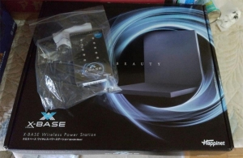
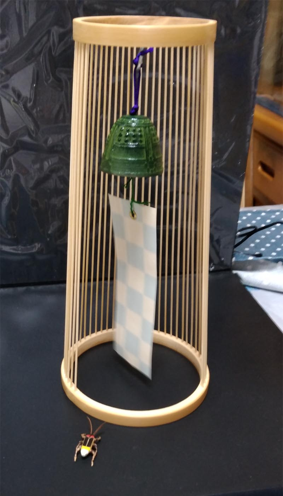
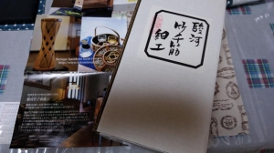

---
title: "10万円給付金の使い道～駿河竹千筋細工とＸ－ＢＡＳＥ！？（新型コロナ関係：2020年7月）"
date: 2020-08-09 14:54:49
category: "旅行・地域"
---

　

コロナ給付金を使って、地元のお店で色々買い揃えました。

※<a href="https://www.marutsu.co.jp/pc/static/shop/shizuoka" target="_blank" rel="noopener">マルツ静岡八幡店</a>

※別売りLED（3,500円）と合わせて2万5千円の出費！

　

Ｘ－ＢＡＳＥは、磁場を発生させるディスプレイ装置です。

（磁場を使って何をするかは後述）

　

ずいぶんと前からマルツさんの店頭に並んでいて、ずっと見てはいたのですが、さすがに2万円はお高い

というわけで手が出なかったのですが・・・買っちゃいました、給付金の10万円の中から。

使い方は決めてあるのですが、お盆明けに入手できるものと組み合わせになるのて、それを待ってディスプレイ予定。

　

　

<strong>３　駿河竹千筋細工</strong>

そしてお盆明けに買ったのは、駿河竹千筋細工の「風鈴」と「ホタル」

※<a href="http://www.takesensuji.jp/" target="_blank" rel="noopener">静岡竹工芸協同組合</a>さんのＨＰから購入可能

鈴の音色も私の好みの音で、アタリでした

　

今年のこの暑気、如何ともしがたい。

廊下なんか歩いていると、まるで『お湯の中を歩ている』ようです。

たまんないですよね。

こんなとき、ふとしたときに風鈴が鳴ると、涼やかな音色が気持ちを穏やかにしてくれる瞬間があります。

　

なお、ホタルを併せて買ったのは、ディスプレイでひと工夫したかったため。

ホタルをこんなふうに風鈴の短冊に付けると、予想どおりなかなかオツな感じになりました。

　

<a href="http://www.takesensuji.jp/" target="_blank" rel="noopener"><strong>静岡竹工芸協同組合のホームページへのリンク</strong></a>

　

　

