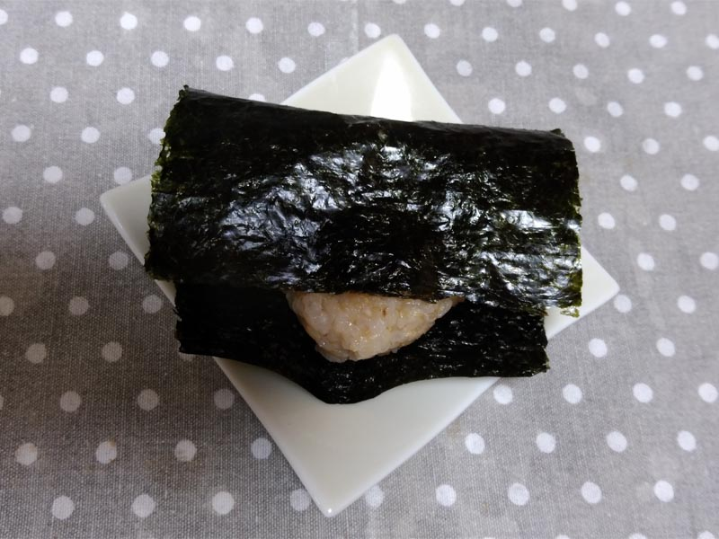

---
title: "ゲンマイ教"
date: 2020-09-04 00:38:50
category: "旅行・地域"
---

～玄米教に入信すれば、便秘の苦から一生解放されますゾ～

　

【玄米教教義】

１．白飯やパンの主食をそっくり玄米に置き換えれば、お通じが毎日スッキリ出る

２．玄米を炊くときは、白米よりも少しだけ多目に水を差す。増し加減は好みで良い

３．１週間のうち１曜を決め安息日とする。安息日は好きな炭水化物を食べて良い

　

【玄米三大メニュー】

玄米メニュー１：普通のご飯、梅干し乗せ

海苔は、地元ではチョー有名な「西田の海苔」

巻いたらパリパリのうちにすぐに食べています。

しっとり海苔の磯の匂いと、玄米の匂いは合わないです。

お昼のお弁当に持って行く場合は、海苔は別にして食べる直前に巻くこと。

　

【玄米について】

最近の玄米は昔ほど、ぬか臭くくさくありません。

取り扱いをしている米屋さんも増えてきているので、自分に合う玄米を売ってる米屋さんが見つかれば、交渉して年間分を押さえるのも手です。

私は、地元にある昔から玄米を扱ってくれている米屋「立間さん」で買ってます。

　

 

