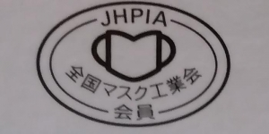

---
title: "（新型コロナ関係）2020年12月下旬のマスク事情"
date: 2020-12-27 13:35:50
category: "旅行・地域"
---

※華やかな話はないのでご承知おきを　

受験生向け新型コロナ対策ムック本の紹介をしたのをきっかけに、現時点（2020年12月）での、地元静岡でのマスク状況をちょっと調べてみました。

受験生を持つ保護者の方々に対して、少しでも情報提供できたら幸いです。

　

　

ドラッグストアの店頭では見つけられなかったサージカルマスクやN95マスク。

医療系製品の仕入れが可能な業者さんを通じて購入し、比較してみました。

　

まずは、製品の写真と概要の比較から。

　

◆N95マスク

まず何よりも信頼すべきは、

信頼の「全国マスク工業会」（JHPIA）会員マーク

これ一択です。

推奨する理由

　・医療系業者さん、地元の薬局とも推奨

　　シロート判断はしません。信頼できる人の言う事を信じる。これのみ。

　・商品を探すときに、探しやすい

　　認定品には必ずこのマークが、箱のどこかに入っています。

　　N95やサージカルといった表記を探すのは、思っていた以上に意外と紛らわしいです。

　

　

◆使い分け

絶対に、飛沫等を吸い込みたくない場合は

N95マスク、ということになりますが・・・　

結局は、マスク単体の性能だけではないので。

手洗いや消毒、または手で目や顔をこすらないといった日常の所作、まで包括的にやっての「感染予防」なので、N95マスクだからってだけでの過信は禁物。

また、価格が10倍以上の開きがある点、入手（在庫）困難の状況から、N95マスクはいざって時（感染場所での消毒作業、医療現場等）だけで使用すべきものでしょう。

春先同様の機会が得られれば、残りは市に寄付する予定。

　

サージカルマスクですが、

上記の対象（用途）からもわかるとおり、N95やDS2といった規格のように対ウイルス性能は保証されません。

あくまでも本人の飛沫を周りに飛ばすのを防ぐ性能が、手作り布マスクより高いことを保証するだけです。

ただし、在庫数は結構あります。

　

薬局（薬剤師）を通して仕入れを依頼すれば、納期をある程度待ってもらって、さらに定価でよければ、入手可能です。

”お付き合いのある”地元の小さな薬局が、頼みになりました。

もし、せっかくちゃんとしたサージカルマスクを依頼ができるなら、このとき、条件として次の指定をしてみてください。

　①全国マスク工業会の会員マーク付き

　②サージカルマスク

　③ASTM-F2100-11規格

　たぶん一見さんでこれ全部の指定をしたら迷惑がられて、やんわりと断られるかもしれませんけど。

　

