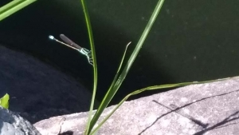

---
title: "職場にある池の課題（築山のビオトープ化）"
date: 2021-08-04 22:40:14
category: "旅行・地域"
---

<a href="https://nyargo1971.github.io/nyargos-blog/2021/07/post-916393.html" target="_blank" rel="noopener">【INDEX】築山のビオトープ化</a>

　

◆そもそも事の起こりは…

　

◆水不足

築山の広さは４００平米程度なので、大したことはありませんが、一番の問題点は、池の慢性的な水不足。

井水が無い地域なので、水の供給ができず、雨水頼み。

（前の職場は富士地域で、井水があったので、常時還流させられて簡単だったのですが。）

　

このため、池の水が淀み、富栄養化を招きやすい。

また、山が丸裸なので、雨のたびに土が流入する。

さらには、夏場は水が蒸発しやすく、いいことなし

　

そこら辺を改善できれば、もうちょっとマシになるのでは？

　

 

