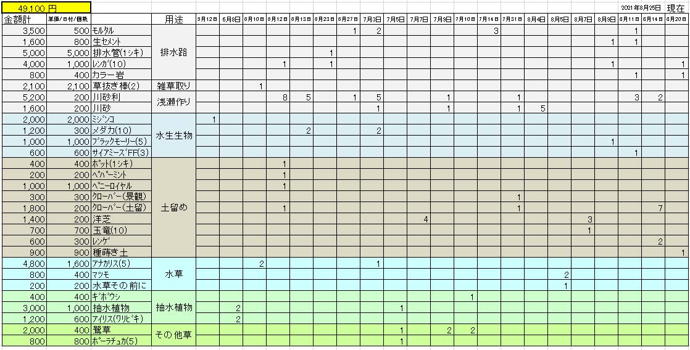

---
title: "（資料）購入金額（築山のビオトープ化）"
date: 2021-08-04 22:46:37
category: "旅行・地域"
---

<a href="https://nyargo1971.github.io/nyargos-blog/2021/07/post-916393.html" target="_blank" rel="noopener">【INDEX】築山のビオトープ化</a>

　

◆購入金額一覧表

3月27日現在　２００，０００円程度

　

◆これまでの購入（抄）

 

オオミジンコを投入。

　

腰を曲げずに草むしりができるステッキを購入。

　

カバープラントのミント類とクローバーのたねをDIYショップで購入。

ペパーミント　２００円

クローバー　２００円

ペニーロイヤルミント※　１，０００円

※ペニーロイヤルは特殊なので通販

ポット類　

竹製熊手　

 

「初めての水草セット」なるカップを購入して投入。

 

調べるとアナカリスが強そうなので、アンカー付きのものを複数本購入して投入

 

水連を２つ投入

 

花が散って７００円に値引きされていたカキツバタを２株

水から立ち上がって葉を出す水草各１，０００円を３種

 

築山の土質の悪さの程度を確認するため、ポーチュラカ２００円を５株購入

 

その後、４００円の鷺草※も３株購入。これは完全に自分の好み。

　

安い砂利。でも角は丸いちゃんとした川砂利です。

 

メダカ４０匹

 

土留めに、洋芝の種を購入

　

マツモの投入

　

アオミドロを（も）食べる魚の投入（ブラックモーリーとサイアミーズ・フライングフォックス）

　

 

　

　

