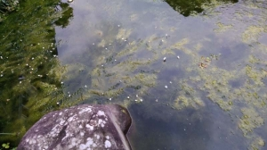

---
title: "アナカリス（築山のビオトープ化）"
date: 2021-08-04 22:59:54
category: "旅行・地域"
---

<a href="https://nyargo1971.github.io/nyargos-blog/2021/07/post-916393.html" target="_blank" rel="noopener">【INDEX】築山のビオトープ化</a>

　

調べるとアナカリスが強そうなので、アンカー付きのものを複数本購入して投入

アオミドロに勝つことはできませんでしたが、しぶとく生き続け、それなりに枝分かれもしている模様だったので、その後も第3次投入まで続けています。

　

実はこの時に、ビオトープ向けの総購入金額が１０，０００円を突破しました。

でも、（勝手にライバル視している）SSHのビオトープ復活作戦では、池を掘り直すという荒業（禁じ手じゃねえの?）をやっている

なので、あんな土木工事に比較すれば安い安い！？

　

（2021年7月25日　追補）

◆アナカリスの株分け作業

この連休、休日仕事の合間を使って手製アンカーを作りました。

これに、株が増えたアナカリスを縛り付けました。

アナカリスの花？

アナカリスが群生しているあたりの水面に、小さな白い花がプカプカ

　

 

