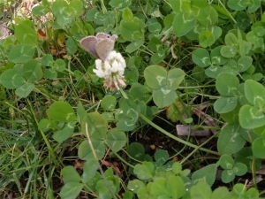

---
title: "土留め用のカバープランツ（築山のビオトープ化）"
date: 2021-08-04 23:35:52
category: "旅行・地域"
---

<a href="https://nyargo1971.github.io/nyargos-blog/2021/07/post-916393.html" target="_blank" rel="noopener">【INDEX】築山のビオトープ化</a>

　

※結論を先に

・クローバーは種を直蒔きで

・ペパーミントはポットで爆増

・ペニーロイヤルは、芽が出たら地植えに移すと大きくなる

　

◆定番のペパーミント・クローバー

６月。

カバープラントに、ミント類とクローバーのたねをDIYショップで購入。

園芸愛好家のブログなどを拝見したところ、これらの植物はとにかくハビコッテ仕方ないとのこと。

　

私の場合は、フラワーガーデンを作るつもりがないので、それでこそ投入する価値があるというもの。

ミントとかのタネを購入

ミニポットに小分けして種まきして、9月の植え替え時期に間に合うように、6月から育成開始。

陽が出てきたらクローバーの花に蝶が

　

　

