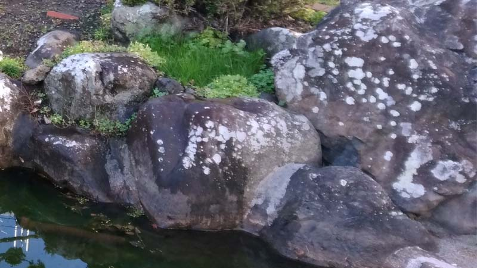

---
title: "洋芝（築山のビオトープ化）"
date: 2021-08-04 23:38:54
category: "旅行・地域"
---

<a href="https://nyargo1971.github.io/nyargos-blog/2021/07/post-916393.html" target="_blank" rel="noopener">【INDEX】築山のビオトープ化</a>

　

[E:#x2605]芝生の欠点を先に

広い場所に敷き詰める、というのでない場合、まだらに発芽して、かつピヨピヨと勝手に丈が伸びる（２０ｃｍ程度）ので、実は余りキレイじゃありません。

また、芝刈り機が入るような場所じゃないと草丈を揃えるのは、現実的には無理でした。

芝刈り機は経験者が操作しなければいけません（結構危ない機械です）。

　

つまり、シロートにとっての芝は、「ゴルフ場のようにはできず」かつ「ランニングコストが掛かる植物」です。

　

　

◆地植えの土留めに、洋芝の種を購入

７月６日

時期ずれしてしまったのでうまくいかない可能性の方が高いのですが、週末になったら築山周囲の平地に洋芝の種を蒔く予定です。

２００円×４袋

除草剤の効果が薄れているか確認するためでもあったり。

　

（2021年7月18日追補）

種蒔きして1週間で、そこかしこで発芽。

マチバリのような小さいやつがピヨピヨと地面から。

カタバミなんかと住み分けしながら、その強力な根で土留めをしてくれています。

　

　

