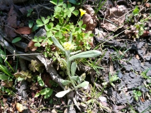
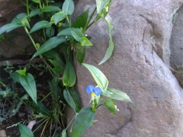

---
title: "雑草抜きは延々に（築山のビオトープ化）"
date: 2021-08-04 23:41:58
category: "旅行・地域"
---

<a href="https://nyargo1971.github.io/nyargos-blog/2021/07/post-916393.html" target="_blank" rel="noopener">【INDEX】築山のビオトープ化</a>

　

◆雑草のコントロール

　雑草は全て抜く（＝庭すべてを園芸種で埋める）、それとも、ある程度の雑草を許容する

　さあ　どっち？

 

常時、手の届く程度の庭なら、前者の選択は、じゅうぶんに可能。

築山の場合は、広さの方は許容範囲ですが、常時世話をしていくというのが不可能。

また、園芸種は、複数年にわたって芽が生えるというものでは無い。

　

そうすると、今回の築山のケースでは、どうしてもある程度は雑草の力を借りる必要があります。

私の場合は、背の低い可愛らしい草（主観的ですが）を、残すことにしました。

　

　　

◆まずは除草剤の停止

除草剤使用停止については、職場の管理部に頼み込んで、区域内全ての雑草取りは、全て私がすることを交換条件で、止めてもらいました。（土日は無くなったな、これで）

　

腰を曲げずに草むしりができるステッキを購入８００円

それと、これ！

4月上旬、黄色い花が咲きました。

やった！ハハコグサだ

　

ハハコグサやそのモドキの姿の見分けに役立つサイト

・<a href="http://www2.kobe-c.ed.jp/shimin/hirose/sprgrass/page0111.html" target="_blank" rel="noopener">市街地の生きもの</a>

・<a href="https://matsue-hana.com/yasou/kubetu/hahakogusa.html" target="_blank" rel="noopener">松江の花図鑑</a>

助かりました

　

ナルホド、

（正真正銘の）ハハコグサは「越年生」なので、冬の間はじっとしてるのか。

それでいて春の七草なので、

ということは、夏～冬にやたら成長するやつらを見分けて駆除すればいいわけか。

　

　

【キク科全般】

スミマセン　ナンチャラ タンポポさん

アナタノナカマハ　スベテ　クジョタイショウデス

わが懐かしきトウカイタンポポ、あの可愛らしい花の姿は何処にも見かけなくなりました。

　

・オニタビラコ

　

・９月～10月

9月は残暑が厳しく、１日で土の表面がパサパサになるので、早朝に水かけ。これがクローバーだけじゃなく雑草くんたちの成長も促すため、土日は全て雑草抜きに。

10月下旬になって、陽が沈むのが早くなってきました。

土の乾燥も少なくなってきたので、水かけはほとんど止めました。

それでも雑草は生える生える。

気が付くと、ブログをほとんど更新する暇も無く2カ月が経過しようとしていました。

天皇賞（秋）は絶対記事にしないと！

　

・11月に入ると

さすがに発芽も少なくなってきて、早朝の作業程度で大丈夫になってきたので、土留めレンガなどの作業に移行し始めました。

　

