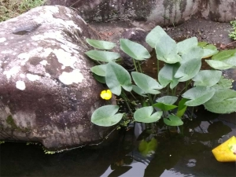

---
title: "浅瀬や岸辺の草花たち（築山のビオトープ化）"
date: 2021-08-04 23:49:39
category: "旅行・地域"
---

<a href="https://nyargo1971.github.io/nyargos-blog/2021/07/post-916393.html" target="_blank" rel="noopener">【INDEX】築山のビオトープ化</a>

　

◆岸辺の植物

「次の次のタイミング」で『めだか』投入を考えています。

その準備段階として、水連に続いてメダカの避難所となりうる岸辺の植物を購入。

これも、どの品種がこの池に向いているのか、全くもってよくわからない。

なので、試験的に多品種を順次購入していくことにしました。

　

花が散って７００円に値引きされていたカキツバタ（アイリス）を２株

　

