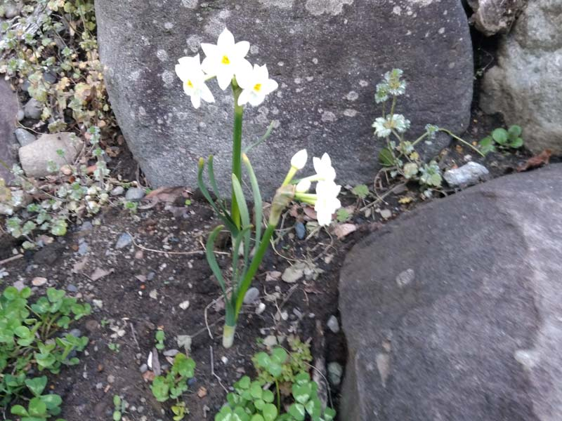

---
title: "地植えの草類（築山のビオトープ化）"
date: 2021-08-04 23:51:50
category: "旅行・地域"
---

<a href="https://nyargo1971.github.io/nyargos-blog/2021/07/post-916393.html" target="_blank" rel="noopener">【INDEX】築山のビオトープ化</a>

　

◆地植えの草類（購入）

　

・ポーラチュカ

郷愁を誘うような可愛らしい名前のとおりの白い花を咲かせる草

あのスベリヒュウの園芸種

築山の土質（地味の悪さの程度）を確認する意味もあって、ポーチュラカ２００円を５株購入。区域内の各箇所に分散して植栽。

球根植物は、来年も芽を出してくれそう。

うちの庭にあった株をいくつか掘り起こして持ち込みました。

踏みつけにはいかにも弱い形をしているので、通路になっていないポケット部分数か所に植えてみました。

　

　

・スミレ

ずっと欲しかった日本の野草のひとつ。

　

・ドクダミ（特殊）

ドクダミは、はびこるので植える場所を厳選。

岩棚のポケットで、根が広がらない低地に植えました。

　

