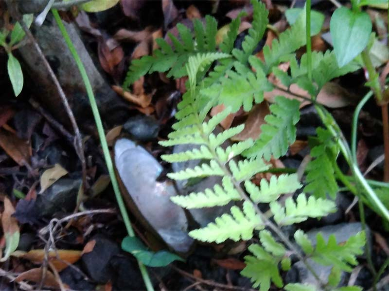

---
title: "啓蟄か（築山のビオトープ化）"
date: 2022-03-04 00:10:28
category: "旅行・地域"
---

<a href="https://nyargo1971.github.io/nyargos-blog/2021/07/post-916393.html" target="_blank" rel="noopener">【INDEX】築山のビオトープ化</a>

　

３月２日。

築山で朝、水かけをしていると　見慣れぬ小さな穴が

　

この１年で、池の浄化専用に投入した動植物は全部で７種。（景観用途のメダカや抽水植物を除く）

・アナカリス

・マツモ

・ウィロビーモス

・サイアミーズフライングフォックス

・ブラックモーリー

・スジシマドジョウ（5月に追加投入）

・ミナミヌマエビ

・マシジミ

・ヒメタニシ

・ドブガイ（5月に追加投入）

　

これらの生物たちが今後どれだけ繁殖してくれるかは未知数で、環境が合わなければ死滅してしまうので申し訳ないのですが、生き残った種が、池のバランスをより良い方向に持って行ってくれると、ありがたいです。

　

　

