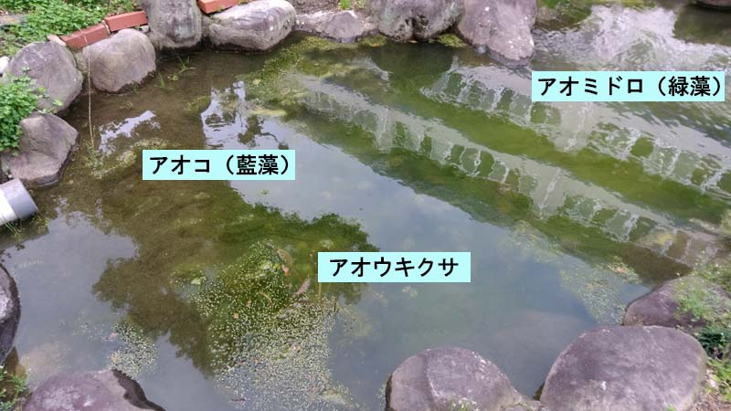

---
title: "まとめ記事（築山のビオトープ化）"
date: 2022-03-29 01:00:11
category: "旅行・地域"
---

<a href="https://nyargo1971.github.io/nyargos-blog/2021/07/post-916393.html" target="_blank" rel="noopener">【INDEX】築山のビオトープ化</a>

　

３月を迎え、まとめ記事

はじめは、単純に「土留め」や「浄化生物」レベル程度のことで考えていたビオトープ化計画も、とうとう3月。

10カ月も現場でやり続けると、作業のコツとか植物名とか単純なこと以外にも、作業上必要があって学んだことの中に潜んでいた科学的知識、というものがあったので紹介したいと思います。

　

◆築山編

（１）病害虫を抑える工夫（その１）

センチュウ、コガネムシ、アブラムシ、いずれも嫌なものですが、せめてもの対策として

半年かけて広げてきたクローバーエリアはほぼ掘り返して（いったん根を生やしたクローバーはそれ位じゃ絶滅しない）、キク科のマリーゴルドと、イネ科の野生種えん麦（えんばく）の種を蒔きました。

boot時点ではほぼ瓦礫と痩せ土の荒れ地だったので、パイオニアとして、安価で発芽しやすいクローバーを蒔いて土留めと緑肥の準備くらいの気持ちでやってきました

が、土留めがほぼ完了して、2年目に当たるこの３月は、バランスを考え直しました。

クローバーや勝手に生えるカラスノエンドウといったマメ科植物ばっかりだと、アブラムシ天国になるので、マメ科の占有面積を相対的に減らす効果を狙ったのがひとつ。

（3月末。温かくなればちゃんと発生してくる3点セット、アオコ、アオウキクサ、アオミドロ。まあ、池全体に充満しなければよし。）

　

１．土や落ち葉といった栄養源の流入や、池内生物自身の死による栄養源化、これら有機物が全てのスタート地点。

※浚渫の９割は魚のうんこ掃除！？

※対策として泥の浚渫が効果的ですが、継続して人的コストが必要。

※浚渫は、堆積物を減らし池の対流圏を増やすため、嫌気性バクテリアによる硫化水素発生を抑える点からも効果大

※浚渫で、ドブ臭や腐卵臭が格段に減ります

　

２．有機物が魚や有機栄養バクテリアのエサになり、アンモニア（NH3）が排出される。

※アオコと言われるラン藻類が含まれる

※ラン藻類の一部は、酸素があれば（好気性下）光合成を行い、酸素が無いと（嫌気性下）硫化水素を発生する

　

３．アンモニアを摂取するのがニトロモナス類のバクテリアで、亜硝酸（HNO2）が排出される。

※このとき、亜硝酸は苔の栄養になるので、コケが大発生（珪藻や緑藻）

※緑藻類にはアオミドロが含まれる

　

４．亜硝酸を摂取するのがニトロスピラ類のバクテリアで、硝酸（HNO3）が排出される。

※ここら辺の過程のバランスが崩れると、バクテリアが死滅し水が白濁する

※硝酸は水草やコケの栄養になるので、水草も成長するがコケも発生してしまう

※硝酸は、アンモニアや亜硝酸に比べて魚への毒性が低い。

　

５．硝酸は、オーバーフローにより池外に排出する。

※硝酸を完全無害な窒素に戻すバクテリアも存在するが、その活動環境を人間サイドで簡単に作り出すのは困難なので、サイクルは硝酸化まで。

※オーバーフローにより硝酸が少なくなっても、先に死滅するのはアオミドロなどのコケ類。生き残り勝負では水草の方が有利。

　

よって、最終的に「硝酸」が池外に排出されれば、コケ類の栄養素が減って、貧栄養状態に近づける。

　

このサイクルをよく見ると、池内でも光合成をエネルギー源にして窒素化合物が再生産されている過程も読み取れます。（≒生かしたい魚や水草も死ねば有機物になる。）

池外からの土の流入を止めるだけでは、富栄養化は止まらないということ。

また、バクテリアのバランスは自然任せなのでなかなか難しいし、泥層が厚いと嫌気性下でバクテリア（ラン藻）が硫化水素を排出するケースまであり得ます。

　

だから、人力で賄える１．の浚渫と、５．のオーバーフローの２つの作業が、いかに大切かということが分かります。

　

でもね、浚渫を実際にしてみると・・・

一人でやってると<strong>１年経っても全然終わらないんですわ！これが</strong>

汲み取っても汲み取っても、尽きないヘドロ

GW中もドブさらいセット持って出動中です

　

　

