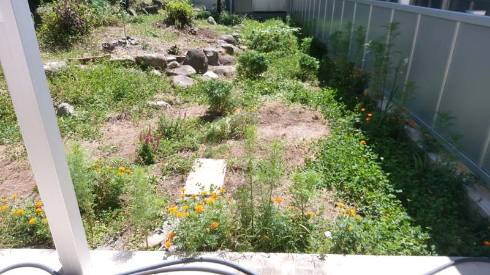

---
title: "２年目の夏越し（築山のビオトープ化）"
date: 2022-09-15 21:14:49
category: "旅行・地域"
---

<a href="https://nyargo1971.github.io/nyargos-blog/2021/07/post-916393.html" target="_blank" rel="noopener">【INDEX】築山のビオトープ化</a>

　

2年目の9月。

異動に伴い行けても週末の休みだけと世話できる量が激減

でも、クローバーとか雑草の次に頑丈な植物で、雑草を抑える戦術なので、そうそうやられないはず

・・・だったのですが

　

◎通路部分は元気です

仕方ないので、剥げたところに秋蒔き春待ちの花の種を蒔きました。

また、この区域は春にミックスフラワーの種をランダムに蒔いたのも裏目に。

通路のつもりの敷石の周りに背の高い草花が生えてしまい、通りにくくなっています。

もっと高さを意識した種植えを計画しないといけないことを痛感。

　

