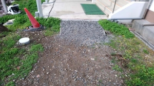

---
title: "結局は１年持たなかった築山の緑化（築山のビオトープ化：最後の記事）"
date: 2022-10-10 21:47:49
category: "旅行・地域"
---

結果的には、転勤してから1年と持たなかった築山の緑化。

転勤後も、週末には出かけて、雑草取りとかして維持してきたんですけど、残念な結果に。

　

・長雨でナメクジが出たようで、除草剤が撒かれた緑地。

この築山の池は、昔住み着いていた鯉のウンコこがヘドロ化し、講堂に流れ込む悪臭が懸案でした。

真夏には干上がるときもあるほどだったので、雨水なら無料だし、補給できるように給水路を作りました。

人力の浚渫と、自然水のオーバーフローの両輪で、ヘドロ集はだいぶなくなってたんですが。

　

　

・というわけで

築山のビオトープ化は、ここまででお仕舞い。

さすがに、どんなに種を蒔いても、池を浚渫しても、人力で壊されるペースには勝てません。

　

 

