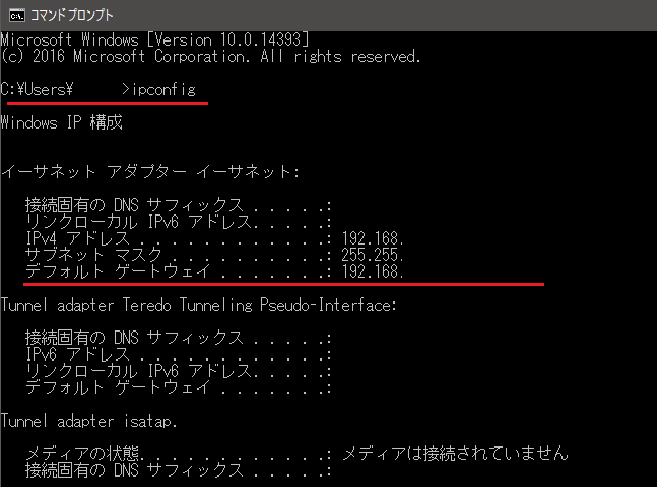
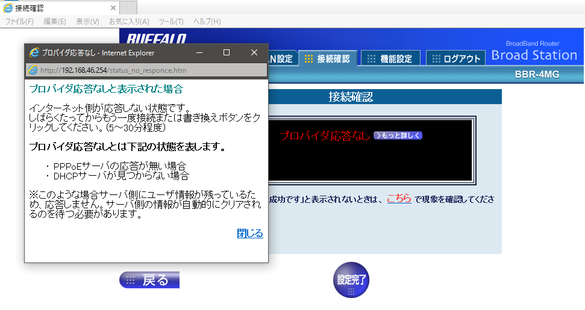

---
title: "え？初期パスワードじゃないんだ（TNCのADSLからTNCひかりに切り替えましたが、ルータ設定でちょっとしたミス）"
date: 2017-05-27 18:17:11
category: "パソコン・インターネット"
---

※今日のブログのオチは、ごく狭い地域(日本国の静岡県）のとあるプロバイダを使っていて、かつ契約変更をした人の中で、うまくいかなかった場合のそのまたごく一部のケースにしか当てはまりません。ご注意ください！

&nbsp;

本日、インターネット回線をADSLからFTTH(光)に変更しました。（やっとかな？）

為替をネットでやるときのレスポンスにこのところ、もたつきがあったので変えちゃう覚悟ができました。

サーバー側の重さ以外はこれでほぼ解決されるでしょう。

&nbsp;

さて、私は地元企業のTOKAI（TNC）をもともと利用していました。

WEBサイトやブログの引っ越しをしたくなかったので、インターネット契約をADSLから光回線に変えるだけにしました。

&nbsp;

◆光開通＆ネットワーク設定に挑戦(失敗編)

お昼近くに地元の有名な某電話通信会社の職人さんが工事に来て、(15時以降の約束だったけど…手が空いたのでと言うので、まあいいや…）家の外からゴシゴシと光ファイバーを引き込み、光インターネット接続に必要なONUという装置を設置していきました。

私も嬉々として、ADSLモデムからONUにLANケーブルを差しなおして、ルータの設定を、事前に送られてあったユーザ名などが書かれている「ご契約内容確認書」のとおり「接続ID」と「ユーザパスワード」書き換えて、接続テスト！…

…

&nbsp;

あれ？

上記のように調べたデフォルトゲートウェイのアドレスを使って、ブラウザのアドレスバーに「http://192.168.xxx.xxx」（xxx.xxxは御自分で調べた値） と入力し、HTTPアクセスを掛けると、ルータ設定のログインページにアクセスできます。

ルータのログインIDとパスワードについては、ルータの設定書でご確認ください。

&nbsp;

（３）ルータの設定を書き換える

ルータの機種によってGUIは異なりますが、ポイントは共通で、あとで順次述べるたった２点だけです。

ルータの設定

・まずポイント1。

インターネット接続方法は、「FTTH」（光ファイバ）の「PPPoE接続」系を選択すること

※BBR-4MGの場合の接続選択（回線種類）の画面

その場合、2パターンに別れます。

・このブログ記事の最初の方で書かれている私の失敗例を参考に、余計な設定をクリアしてから、上記の設定をされた方の場合…

このメッセージが出ても、再度別ウインドウでブラウザを立ち上げてみてください。もしくはPCを再起動してみてください。

インターネットが使えるかもしれません。

これは、サーバ（ISP）側が（古い）失敗接続をもとに回答しているためです。

・PCで誤った接続設定をしたのが残っている場合…

私の失敗例をご覧ください。

削除しなければならないネットワーク設定があるので、私の失敗記事を参考に、御自分の設定用PCの現状をご確認ください。

&nbsp;

&nbsp;

今回の記事がどこかの誰かにお役に立つといいのですが。

