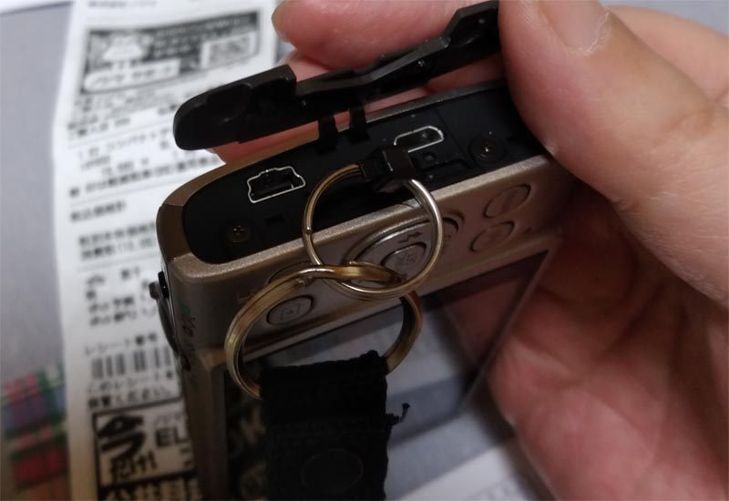

---
title: "スタンダード デジカメCanon IXY650を買いました"
date: 2020-05-10 00:42:14
category: "パソコン・インターネット"
---

※５月１０日は母の日

ＵＳＢコネクタが、２種類付いているのは良い所なんですが、それもあってこのプラスチックカバーがでかい。

しかもそれを細い２つの接続部で支えているという、不安定な構造。

（多分、長く使っていると、ここから壊れて内部が露出して漏電故障するだろうなぁ、と今から確信してしまう程のデカさ）

このカバー部品を壊したくなかったので、力任せに環を付けるのは諦めて、結束バンドでごまかしました。

　

結束バンドの対候性は１年程度が目安。

１年ごとに忘れずに取り替えることにします。

　

・ＩＸＹ６５０のおすすめポイント

基本、操作感は変わっていない

２１０より光学ズーム性能が良い

　

・総評

もし、ＩＸＹの買い換えなら・・・

昔のとはバッテリーの規格が変わっているので、ついでに予備バッテリーも買い足しをおすすめ

Ｗｉ－Ｆｉ機能が付いているので、ＵＳＢケーブルは付属していない

（下取り割引を使われる場合は、古い機種についていたUSBケーブルは店に渡さないように）

コネクタカバーがデカすぎて、長持ちし無さそうなので、２１０か２００でじゅうぶん

（店頭で２１０と同じ価格帯なのも、もしかして耐久度問題があるからじゃない？）

　

長く使ってみた後で、このタイプのカバーの耐久度を、いずれ報告します。

　

