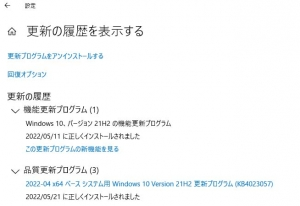

---
title: "プロキシ経由のwindowsアップデイト(KB4023057,0x80d05011関連)"
date: 2022-05-24 23:02:17
category: "パソコン・インターネット"
---

職場で先日あった出来事

（おうちのパソコンでは、まず起きないトラブルです）

　

KB4023057

　アップデイトの番号。

　品質更新プログラムの一つ。

　アップデイトをよりスムースにできるようにするためのアプリ

（ってどこがやねん！今、それで困ってんねん）

　ネット上では評判が悪い。

　

0x80d05011

　エラーコードID。

　プロキシ関係のエラー。

　トラブってる端末が使っているプロキシサーバと、KＢが決めたルールとで、相いれない何かの相性トラブルがある。

　

・経緯　

職場は、出先の事業所で、職場にあるサーバはユーザ管理を行っておらず（2019年ころ仕様変更）、フォレストを組まなくなりました。

今は全て本事務所が一括でユーザ管理しています。

加えて、Ｖ－ＬＡＮで業務用とその他用に分けられていて、業務用端末では、設定・コントロールパネルは個人設定以外変更できない仕様です。

業務用の仕様と設定方法はブラックボックス。本事務所のセキュリティ部署以外、閲覧すらできません。

　

今回トラブルがあったのは、その他グループの端末。

出先の事務所の場合、イレギュラーな現場状況に対応するため、インターネットとメールサーバだけ開放されているＶ－ＬＡＮネットワークに、端末を設置できるようになっています。（≒管理サーバ内の情報資産への接続はできない）

　

インターネット接続も、通信会社とプロバイダが定められていて、かつ本事務所の決めたプロキシサーバを経由しないとＷＥＢ閲覧ができません。

　

前置きが長くなりました。

つまり、事務所っていうところは・・・

上が決めたとおりのインターネット設定しか許されない

正しい設定内容がブラックボックス

イレギュラーな端末も設置は許すけど、許されることしかできない。

設定変更は自己責任。

（今は、性悪説に則って、ＭＡＣアドレス管理の指定端末以外の全端末を遮断するルールが多い）

　

・今回のケースでは

これまでのウィンドウズアップデイトが滞り御なくできていたことからも分かるように（5月11日のWin10 ver21H2の更新は無難に終えている）

特定のアップデイトだけがうまくいかないってのは、まあまあ　ある話です。

こういう時、マイクロソフトには「システム管理者に聞いてください」と言われ

本事務所には「設定は開示しない。自己責任で。」と言われる。

設定もブラックボックス。

　

・唯一の救い

その他端末には、admin権限を持ったアカウントがある点。

端末内の設定や状況は、全て閲覧・操作できます。

　

・手渡された状況

ほぼ以下の画面のとおりでした。

　

ウインドウズアップデイトの悪癖は、失敗アップデイトのためのダウンロードの試みを延々と（しかも優先的に）繰り返して、ネットワーク帯域はおろか、CPU・メモリ・ドライブ（記憶域）までガリガリに使うこと。

それでひどいビジーになっていて、調べることすらままなりません。

（マウス操作が著しく遅れる、クリックに反応しない程度のビジー）

　

とりあえず、ネットワークから分離（LANケーブルを引っこ抜く）

　

win10のアップデイトには、『更新を7日間一時停止』（＝一時的でも、恣意的にアップデイトを行わなくさせることができる）～下の画面の緑色の枠～があるので、それを選択。

まあ、結果的にうまくいったので助かりました。

　

　

　

